# Session 13: Storage, HPA and Probes

**Submitted by:** Rashi
**Roll No:** 10389
**Batch:** B

Everything below was run on macOS against a local kind cluster (Kubernetes v1.37.0) with
metrics-server installed. The YAML files are the ones in
[session-13-storage-hpa-probes](../../session-13-storage-hpa-probes/).

## 1. Volumes

A container's own filesystem is thrown away with the container. A volume gives the Pod storage
that is separate from the container image.

| | emptyDir | hostPath |
|---|---|---|
| Where the data lives | Empty folder created when the Pod starts | A folder on the node |
| Survives Pod deletion | No | Yes, as long as the Pod lands on the same node |
| Survives container restart | Yes | Yes |
| Typical use | Cache, scratch space, sharing files between containers in a Pod | Local testing, node-level agents (logs, Docker socket) |

### Run emptyDir Pod

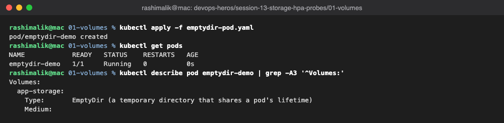

### Create a File

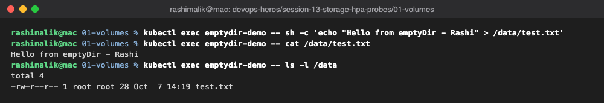

### Delete the Pod

After deleting and recreating the Pod the file is gone. The `emptyDir` was created with the old
Pod and deleted with it.

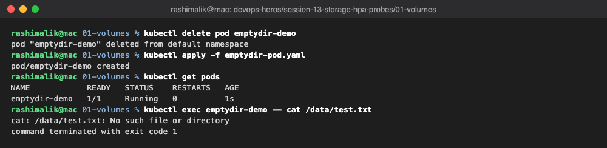

## 2. PersistentVolume and PersistentVolumeClaim

- **PV** is a piece of storage that exists in the cluster, independent of any Pod.
- **PVC** is a request for storage (size + access mode). Pods mount the PVC, never the PV directly.
- `Bound` means the claim has been matched to a volume.
- Data on the volume outlives the Pod.

```text
Pod  ->  PVC  ->  PV  ->  actual storage
```

### Create PV, PVC and Pod

One thing I noticed here: `student-pv` stayed `Available` and the claim was bound to a new
`pvc-...` volume instead. `pvc.yaml` has no `storageClassName`, so Kubernetes filled in the default
class (`standard`) and the provisioner created a fresh volume. To bind to the hand-made PV, the
claim needs `storageClassName: ""`. The storage test below still works because the claim is bound
to a real persistent volume either way.

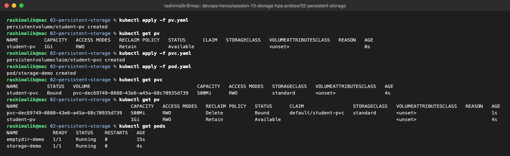

### Test Persistent Storage

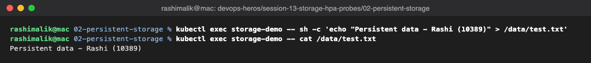

### Delete the Pod

The file is still there after the Pod is recreated, because it lives on the volume, not in the Pod.

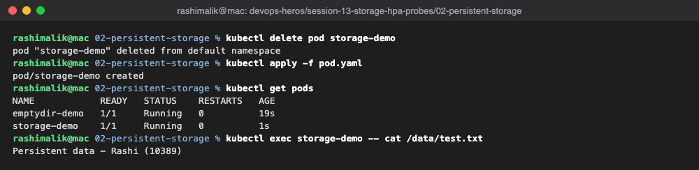

## 3. StorageClass

- A StorageClass tells Kubernetes **how** to create volumes. When a PVC asks for that class, a
  PV is created automatically. This is **dynamic provisioning**.
- On kind the default class is `standard`, backed by `rancher.io/local-path`.
- A PVC without `storageClassName` uses the default class.
- `reclaimPolicy: Delete` means the PV is removed when the PVC is deleted.

```text
PVC  ->  StorageClass  ->  PV created automatically
```

### Check StorageClass

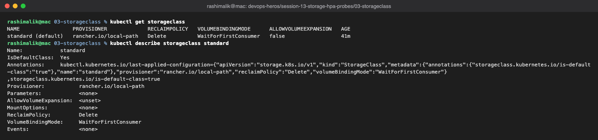

### Dynamic PVC

kind's StorageClass uses `WaitForFirstConsumer`, so the claim stays `Pending` until a Pod that
uses it is scheduled. As soon as the `dynamic-demo` Pod started, a PV was created and the claim
became `Bound`.

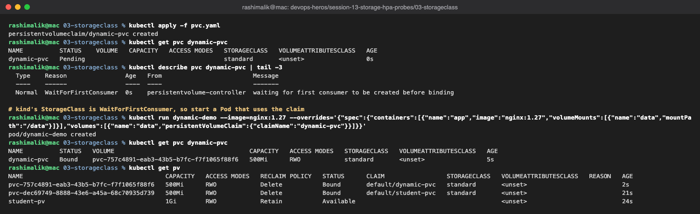

## 4. Horizontal Pod Autoscaler (HPA)

- HPA adds or removes Pods of a Deployment based on a metric, here average CPU.
- It needs **metrics-server** and a `resources.requests.cpu` on the container, because the
  percentage is calculated against the request (100m in this demo).
- Scale up is quick. Scale down waits for a 5 minute stabilization window so Pods don't flap.

### Deployment and Service

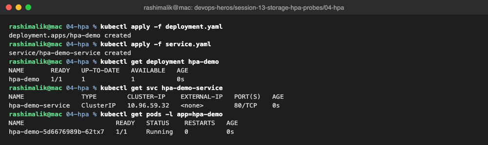

### Metrics Server

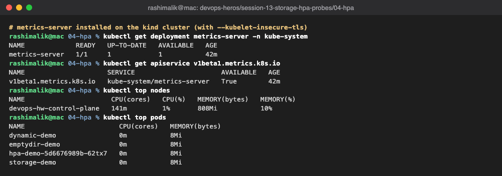

### Create HPA

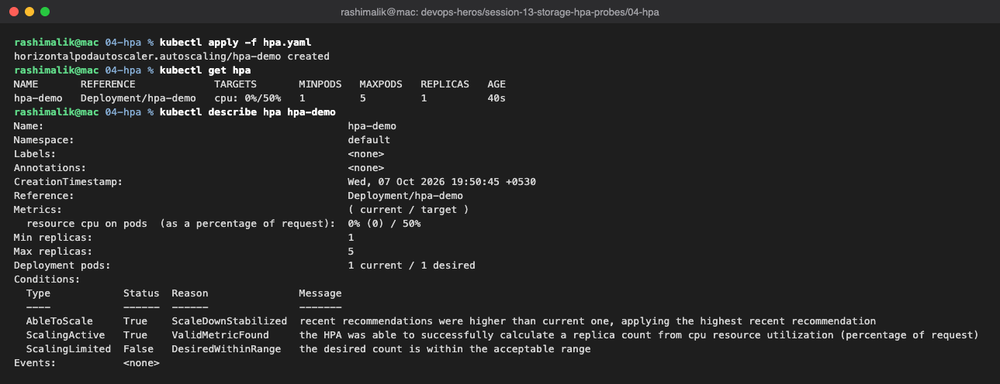

### Generate Load

CPU went from 0% to 81% within a minute, and the HPA scaled the Deployment from 1 to 2 Pods.
With two Pods sharing the traffic, each settled around 41% (below the 50% target), so it stopped
at 2.

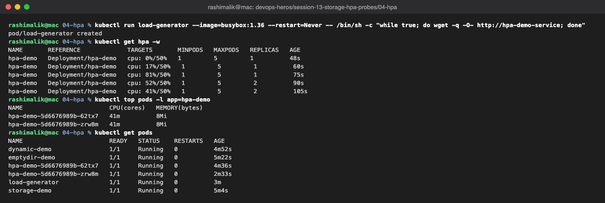

### Stop the Load

CPU dropped to 0% right away, but the replica count stayed at 2 for about 5 minutes before going
back to 1. The two `SuccessfulRescale` events show both directions.

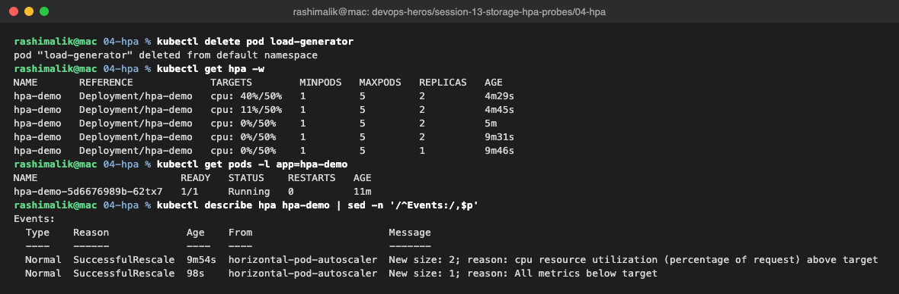

## 5. Probes

A Pod can show `Running` while the application inside is broken. Probes let the kubelet check the
application itself.

| Probe | Question it answers | What happens on failure |
|---|---|---|
| Startup | Has the app finished starting? | Container restarted; other probes wait until it passes |
| Readiness | Can it receive traffic right now? | Pod removed from Service endpoints, **no restart** |
| Liveness | Is it still alive? | Container restarted |

### Liveness Probe

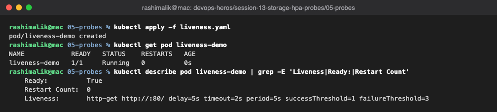

### Readiness Probe

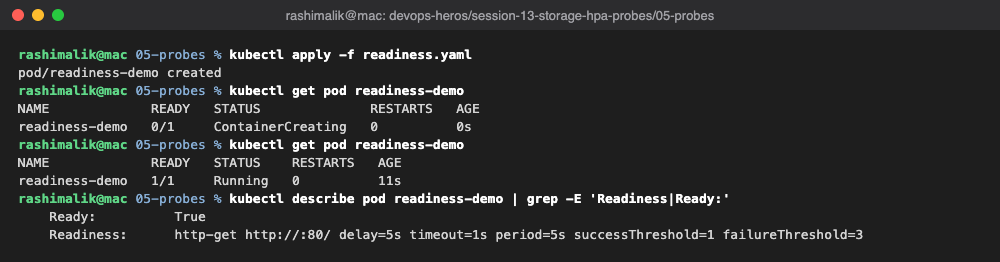

### Startup Probe

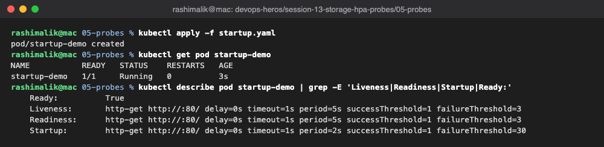

### Breaking Readiness

Probe settings can't be edited on a running Pod (`kubectl apply` is rejected), so I deleted the
Pod and recreated it with the path changed to `/wrong-path`. nginx returns 404, the Pod stays
`Running` but `0/1` ready, and the Service endpoint is marked `ready=false`, so no traffic goes
to it. The restart count stays 0.

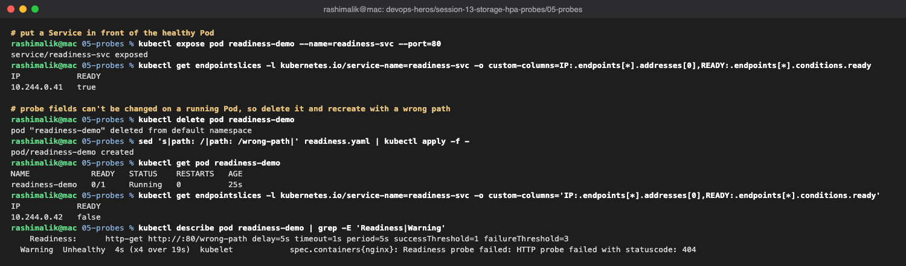

### Breaking Liveness

Same change on the liveness probe. After 3 failed checks the kubelet kills the container and
starts it again, and the restart count keeps climbing.

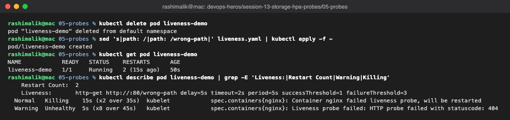

## 6. Mini Project

A web app in the `production-webapp` namespace that combines everything from this session.

| Part | Setup |
|---|---|
| Storage | PVC `web-data`, 500Mi, mounted at `/data` |
| Scaling | HPA from 2 to 5 Pods at 50% CPU |
| Health | Startup, readiness and liveness probes on `/` |
| Access | ClusterIP Service `web-service` on port 80 |

### Deployment

The HPA shows `<unknown>` for the first minute until metrics-server has its first sample.

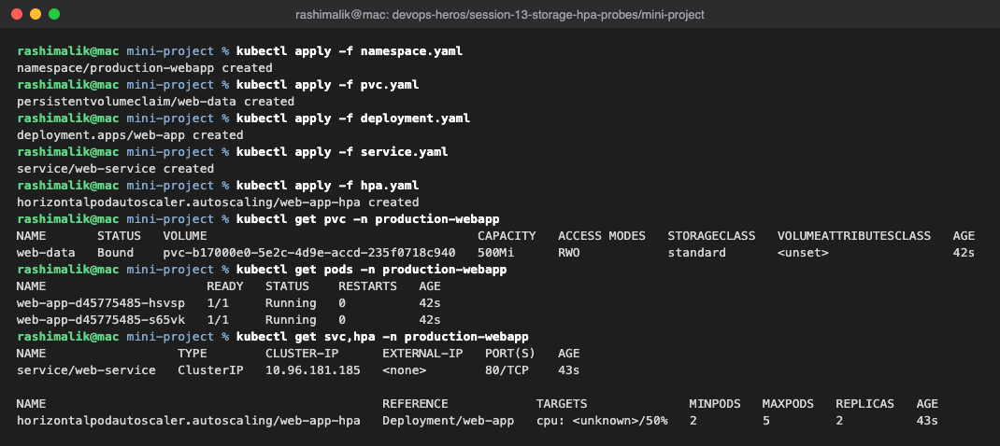

### Storage Persistence

The file written from one Pod is still there when read from the replacement Pod.

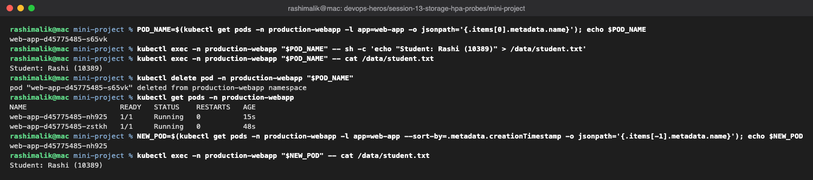

### Service Verification

Port 8080 was already used by another container on my machine, so I forwarded to 8090.

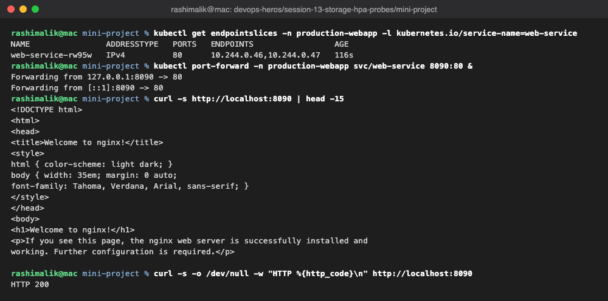

### HPA Scaling

CPU rose to about 42% per Pod under one load generator, which is under the 50% target, so the
HPA kept the minimum of 2 Pods. After the load generator was deleted, CPU fell back to 1%.

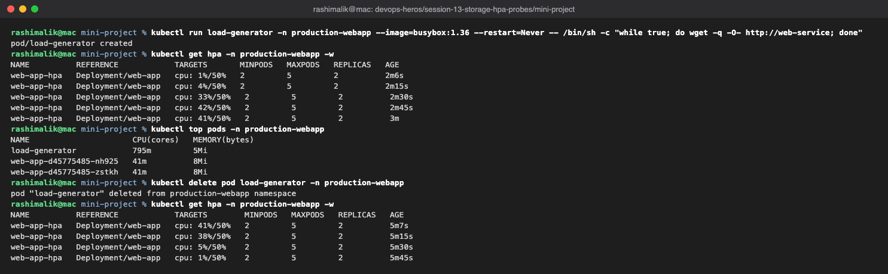

## Key Learnings

- **emptyDir** lives and dies with the Pod; **PVC** data survives Pod deletion.
- A PVC without `storageClassName` gets the default class, which can bypass a hand-made PV.
- **StorageClass** + dynamic provisioning removes the need to create PVs by hand.
- **HPA** needs metrics-server and CPU requests; it scales up fast and down slowly.
- **Readiness** controls traffic, **liveness** and **startup** control restarts.
