# Session 14: Kubernetes Troubleshooting

**Submitted by:** Rashi
**Roll No:** 10389
**Batch:** B

All commands were run on macOS against a local kind cluster (Kubernetes v1.37.0). The YAML files
are the ones in [session-14-kubernetes-troubleshooting](../../session-14-kubernetes-troubleshooting/).

The order I follow instead of guessing:

```text
get  ->  describe  ->  events  ->  logs  ->  exec  ->  test  ->  fix  ->  verify
```

## 1. kubectl get

Tells you **what** state things are in right now. The columns to read first are `STATUS`, `READY`
and `RESTARTS`. `-o wide` adds the Pod IP and the node, `--show-labels` shows the labels that
Services and Deployments select on.

### Pods and Wide Output

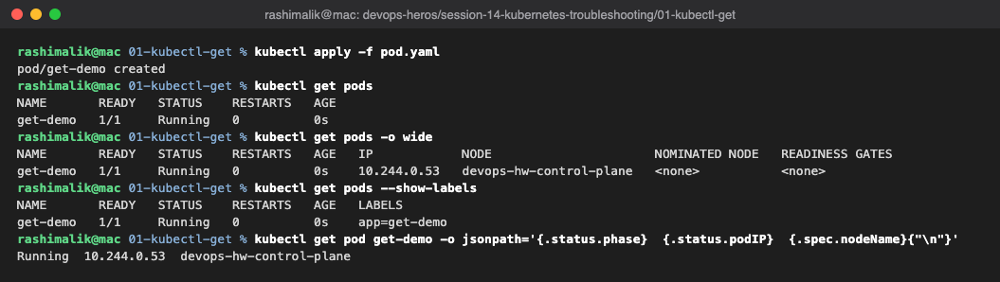

### Other Resources

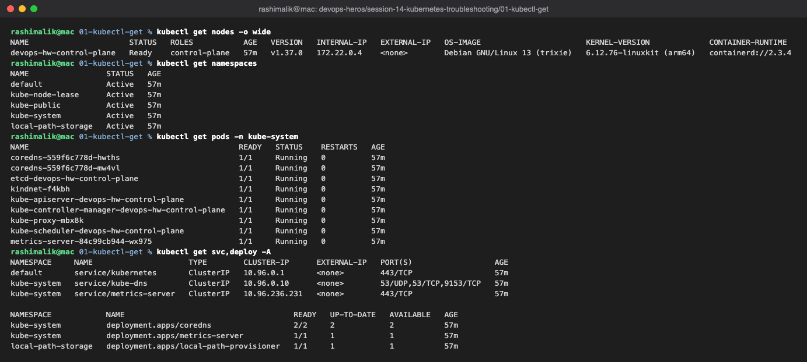

### Watching Changes

`-w` keeps the command open and prints a new line on every change. Here a second terminal deleted
the Pod and the watch showed `Running -> Terminating -> Completed`.

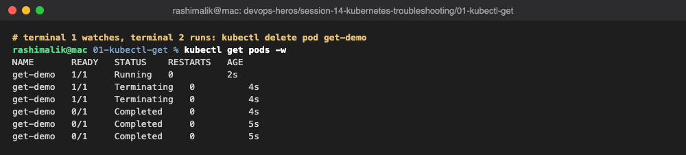

## 2. kubectl describe

Tells you **why**. The useful parts are the container `State`, the `Conditions` and the `Events`
list at the bottom.

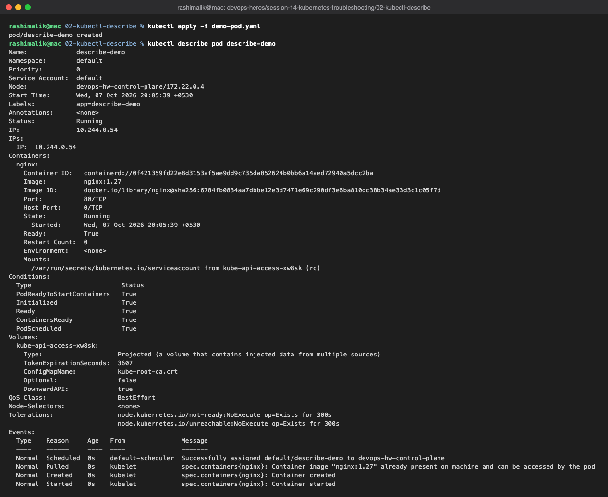

## 3. kubectl logs

Shows what the application wrote to stdout/stderr.

- `--tail=N` only the last N lines
- `--timestamps` adds the time of each line
- `-f` follows new lines live (stopped with Ctrl+C)
- `--previous` logs of the previous (crashed) container
- `-c <name>` picks a container in a multi-container Pod

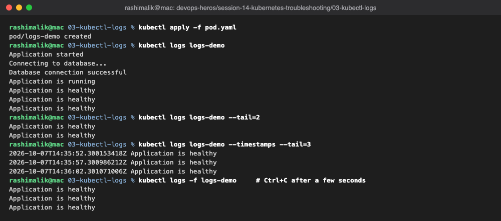

## 4. kubectl exec

Runs a command inside a running container, useful to test the app from the inside. It is no help
when the container keeps crashing, since there is nothing running to enter.

### Shell Inside the Container

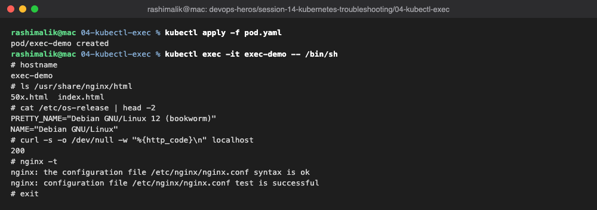

### Single Commands Without a Shell

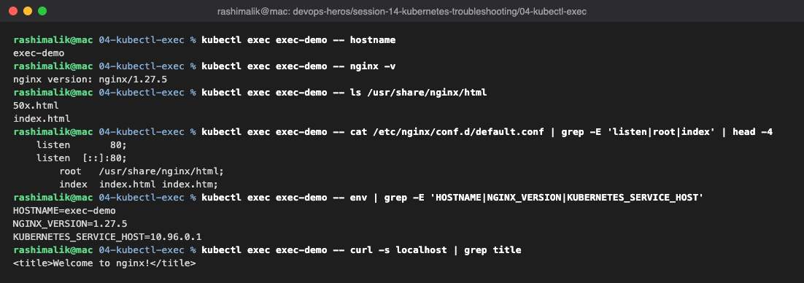

## 5. Events

Events are Kubernetes' activity log: scheduling, pulling images, starting containers, probe
failures, scaling. They are kept for about an hour. I cleared the old events from earlier labs
first so this output only shows the new Pod.

### Listing Events

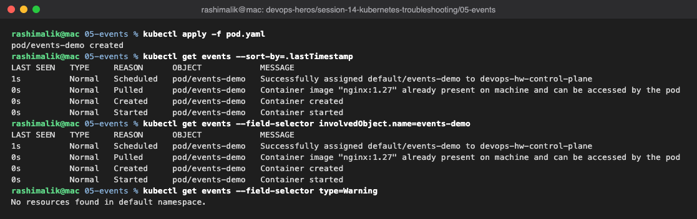

### Events in describe and kubectl events

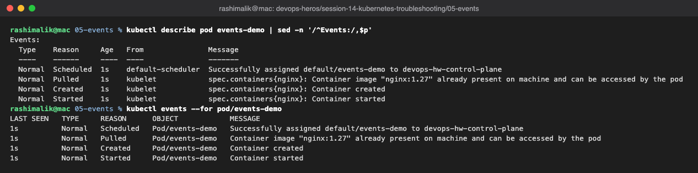

## 6. CrashLoopBackOff

The container starts, exits, and Kubernetes keeps restarting it with a growing delay (10s, 20s,
40s ...). `CrashLoopBackOff` is a symptom; the reason is in the logs and the exit code.

### Broken Pod

The watch shows the loop: `Running -> Error -> CrashLoopBackOff -> Running ...` with the restart
count going up.

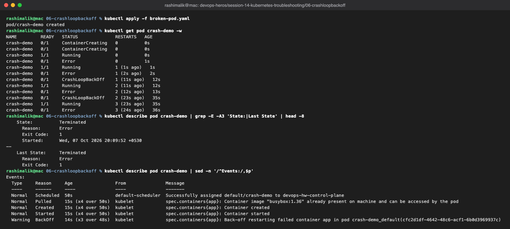

### Logs

`kubectl logs` shows the app printed "Something went wrong!" and the exit code is 1. The command in
the YAML ends with `exit 1`, so the container can never stay up.

On this cluster `--previous` failed with "unable to retrieve container logs". The current
container had already exited, and kubelet had removed the one before it. A plain `kubectl logs`
still shows the crashed run's output.

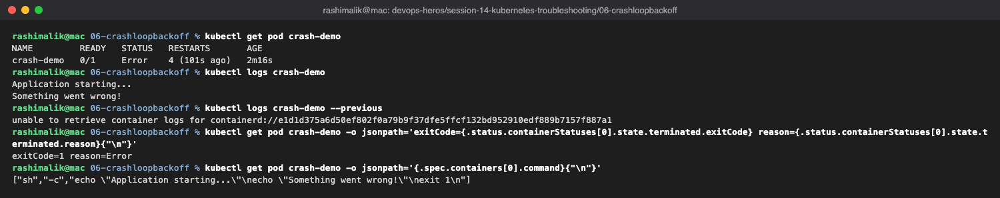

### Fixed Pod

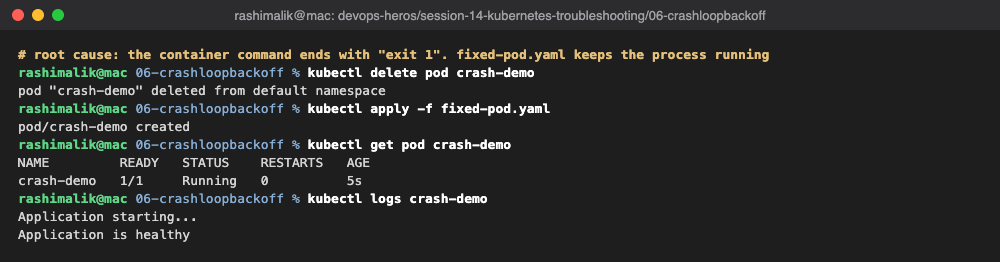

## 7. ImagePullBackOff

Kubernetes can't download the image. First attempt fails with `ErrImagePull`, then it backs off
and shows `ImagePullBackOff`. The `Failed to pull image ... not found` event gives the reason: the
tag `nginx:this-image-does-not-exist` doesn't exist.

### Broken Pod

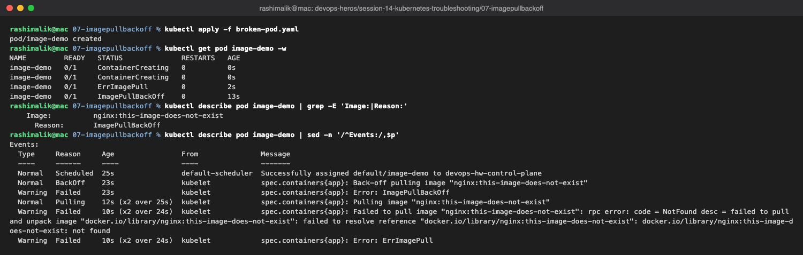

### Fixed Pod

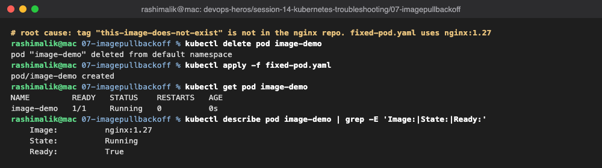

## 8. Pending Pods

The scheduler couldn't find a node for the Pod. `FailedScheduling` says
`0/1 nodes are available: 1 node(s) didn't match Pod's node affinity/selector`. The Pod asks for
`kubernetes.io/hostname=node-that-does-not-exist`, but the only node is `devops-hw-control-plane`.

### Broken Pod

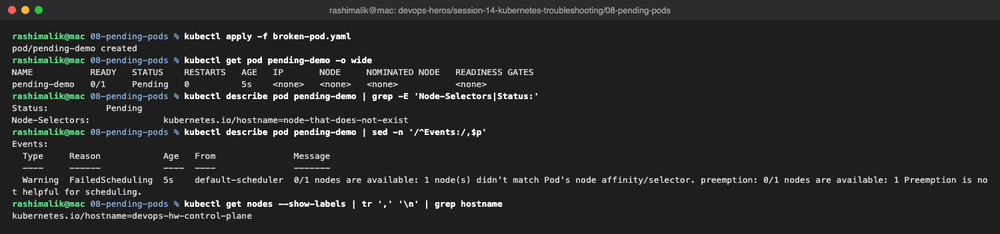

### Fixed Pod

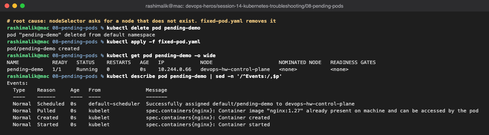

## 9. Service and DNS

A Service finds its Pods through its **selector**. If the selector doesn't match the Pod labels,
the Service has no endpoints and traffic fails, even though the Pods are perfectly healthy.

```text
Pod labels  ->  Service selector  ->  Endpoints  ->  ClusterIP  ->  DNS name
```

### Deployment and Service

The `service.yaml` in the folder uses `app: web-ahsgdf`, so the endpoints came out `<none>`.

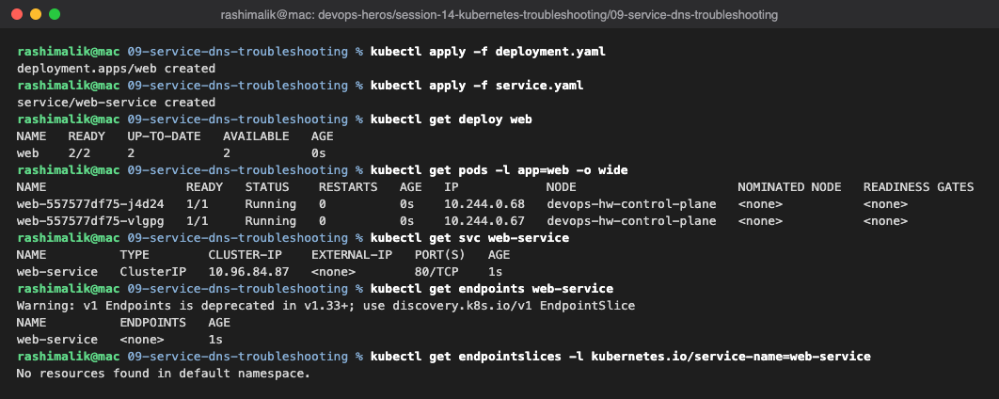

### Finding and Fixing the Selector

The Pods are labelled `app: web`. After patching the selector to `app: web` the endpoints list the
two Pod IPs.

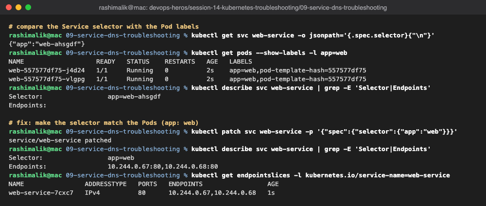

### DNS and HTTP Test

A second, unplanned problem: `dns-test-pod.yaml` uses `registry.k8s.io/e2e-test-images/dnsutils:1.3`,
which doesn't exist, so the test Pod itself was stuck in `ImagePullBackOff`. The image is called
`jessie-dnsutils`. With that name the Pod started, and `web-service` resolved to its ClusterIP.
The `search` line in `/etc/resolv.conf` is why the short name works.

DNS name format: `<service>.<namespace>.svc.cluster.local`.

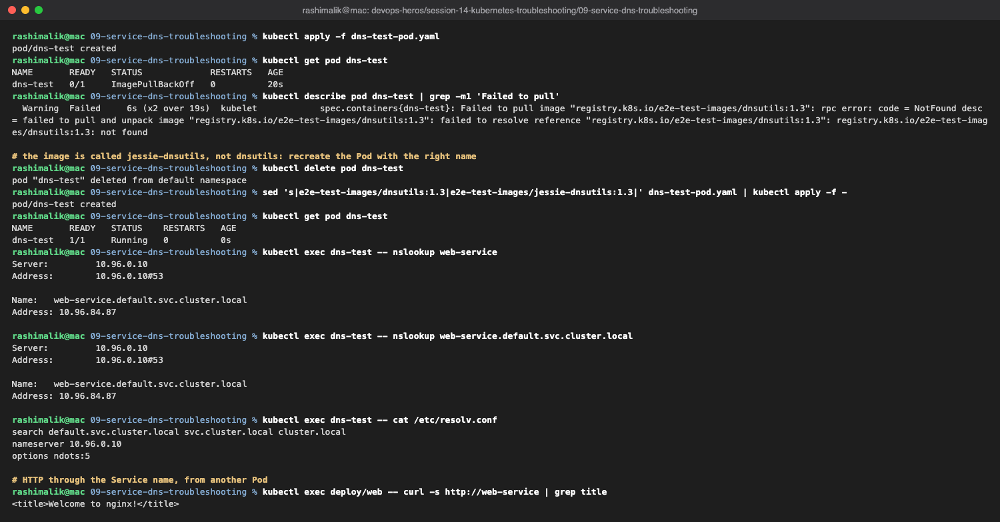

### Broken Service

`broken-service` gets a ClusterIP and a DNS record, but its selector `app: does-not-exist` matches
nothing. `nslookup` works, while `curl` fails with exit code 7 (could not connect). DNS working
doesn't mean the Service has anything behind it.

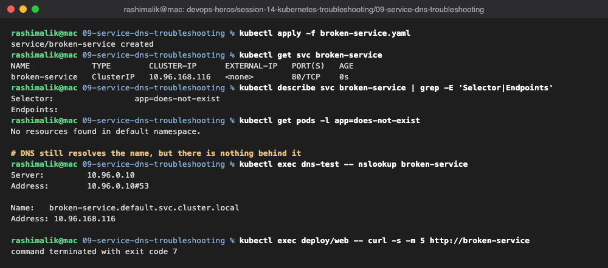

### CoreDNS

CoreDNS runs as 2 Pods behind the `kube-dns` Service on `10.96.0.10`, the same address that is in
every Pod's `resolv.conf`. The `kubernetes cluster.local` block in the Corefile answers Service
names, and everything else is forwarded upstream.

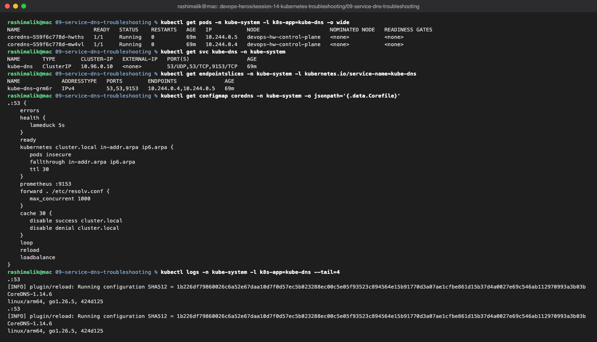

## 10. Mini Project

### Deploy the Application

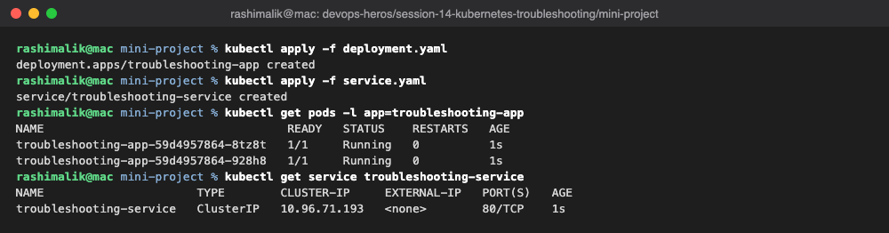

### Check the Application

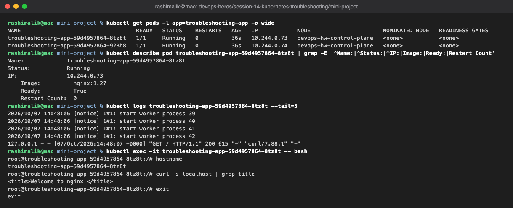

### Check the Service and Endpoints

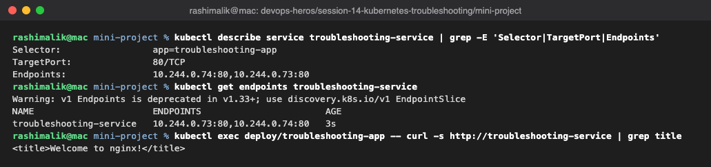

### Broken Pod

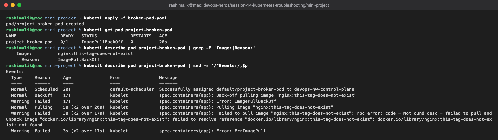

**Q1. What is the Pod status?**
`ErrImagePull` at first, then `ImagePullBackOff`.

**Q2. What is the actual error?**
`failed to resolve reference "docker.io/library/nginx:this-tag-does-not-exist": not found`. The
registry has no image with that tag.

**Q3. Which command helped find the reason?**
`kubectl describe pod project-broken-pod`, in the `Events` section.

**Q4. What is wrong with the image?**
The tag `this-tag-does-not-exist` doesn't exist for `nginx`.

**Q5. How would it be fixed?**
Use a valid tag such as `nginx:1.27`, delete the Pod and create it again (an image change on a bare
Pod needs a recreate). Shown at the end of the next screenshot.

### Service Selector Problem

Changed the selector to `app: wrong-app`. The Service still exists and has a ClusterIP, but the
endpoints are `<none>` and requests fail.

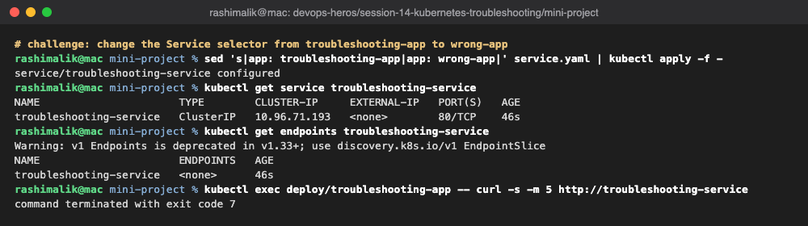

### Root Cause and Fix

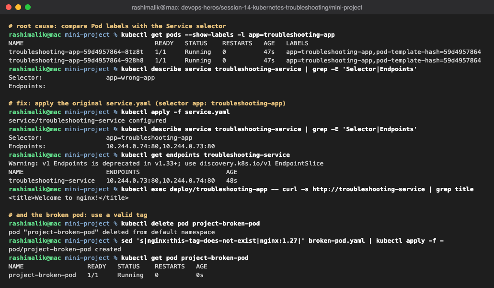

### Troubleshooting Table

| Problem | What I Saw | Command I Used | Root Cause | Fix |
|---|---|---|---|---|
| Crashing Pod | `Error` / `CrashLoopBackOff`, restarts climbing | `kubectl logs`, exit code in `describe` | Command ends with `exit 1` | Use `fixed-pod.yaml` |
| Image problem | `ErrImagePull` / `ImagePullBackOff` | `kubectl describe pod` (Events) | Image tag doesn't exist | Use a valid tag (`nginx:1.27`) |
| Pending Pod | `Pending`, no node, no IP | `kubectl describe pod` (FailedScheduling) | `nodeSelector` for a non-existent node | Remove the selector |
| Service problem | Endpoints `<none>`, curl exit 7 | `kubectl get endpoints`, `--show-labels` | Selector doesn't match Pod labels | Correct the selector |
| DNS test Pod | `ImagePullBackOff` on `dnsutils:1.3` | `kubectl describe pod dns-test` | Wrong image name | `jessie-dnsutils:1.3` |

### README Questions

1. **What does `kubectl get` tell us?** The current state of a resource: status, readiness,
   restarts, age, and with `-o wide` the IP and node.
2. **Difference between `get` and `describe`?** `get` is a one-line summary per object.
   `describe` is the full detail of one object, including its Events.
3. **Why use `kubectl logs`?** To see what the application itself printed, which is usually where
   the real error behind a crash is.
4. **When to use `kubectl exec`?** When the container is running and you need to test from inside
   it, such as `curl localhost`, checking files, env vars or DNS.
5. **What does `CrashLoopBackOff` mean?** The container keeps exiting and Kubernetes is waiting
   longer and longer before restarting it.
6. **What does `ImagePullBackOff` mean?** The image couldn't be pulled (wrong name/tag, private
   registry without credentials, or no network) and Kubernetes is backing off before retrying.
7. **Why can a Pod stay `Pending`?** No node can take it: not enough CPU/memory, a node selector or
   affinity that matches nothing, taints without tolerations, or an unbound PVC.
8. **Why can a Service have no endpoints?** Its selector matches no Pod labels, or the matching
   Pods are not Ready.
9. **Selector and labels relationship?** A Service only sends traffic to Pods whose labels match
   every key/value in its selector.
10. **What is Kubernetes DNS?** CoreDNS gives every Service a name like
    `web-service.default.svc.cluster.local`, so Pods can reach Services by name instead of IP.

## Key Learnings

- `get` shows what, `describe` and events show why, `logs` shows what the app said.
- `CrashLoopBackOff`, `ImagePullBackOff` and `Pending` are symptoms. The root cause is always in
  the events or logs.
- Most "Service is down" problems are label/selector mismatches. Check endpoints first.
- DNS resolving a name only proves the Service exists, not that it has working Pods behind it.
