# Session 15: Helm

**Submitted by:** Rashi
**Roll No:** 10389
**Batch:** B

Helm is the package manager for Kubernetes. A chart is written once and installed into any
environment by passing different values. Everything here was run on macOS with Helm v4.3.0
against a local kind cluster. The charts are the ones in [session-15-helm](../../session-15-helm/).

| Term | Meaning |
|---|---|
| Chart | A package of Kubernetes templates plus default values |
| Release | One installed instance of a chart in the cluster |
| Revision | A numbered version of a release, created on every install/upgrade/rollback |
| Values | The variables that fill in the templates |

Since Helm 3 there is no Tiller. Helm is a client-only tool and keeps each release's state as a
Secret in the release's namespace.

## 1. What is Helm

### Helm Version and Releases

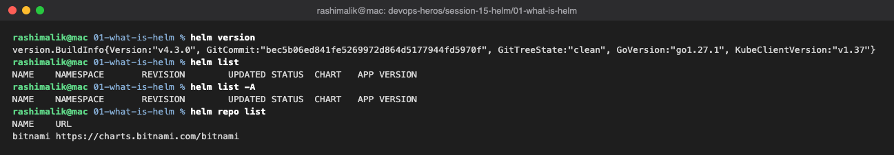

### Installing a Public Chart

`helm repo add` registers a chart repository, `helm repo update` refreshes its index and
`helm search repo` finds charts in it. The Bitnami chart printed a warning that only some of their
images are still free since August 2025, but the `latest` nginx image still installed fine.

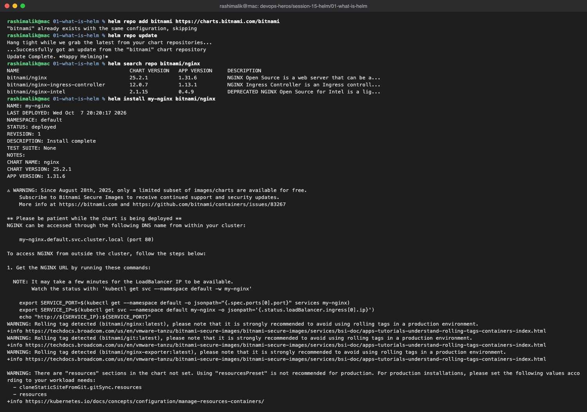

### Checking and Removing the Release

`helm status` shows the release state, `helm get values` shows the values I supplied (none here)
and `helm get manifest` shows every resource the chart created. `helm uninstall` removed all of
them in one command.

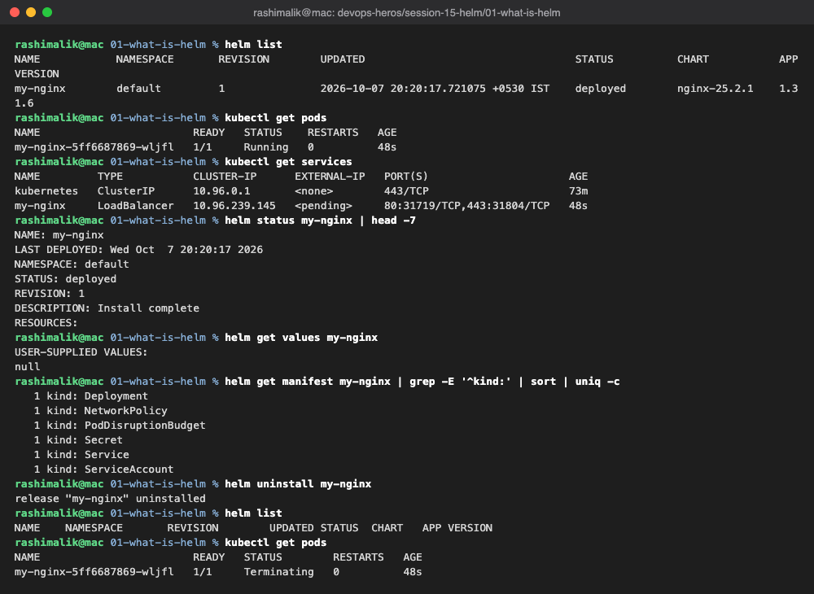

## 2. Helm Charts

- `helm create` generates a complete, working chart skeleton.
- `helm template` renders the YAML locally without touching the cluster, which is the easiest
  way to debug a chart.
- `helm uninstall` removes every resource that belongs to the release.

I ran `helm create` in a separate scratch folder (`helm-lab`) so it wouldn't overwrite the
`demo-chart` that is already in the repo.

### Creating a Chart

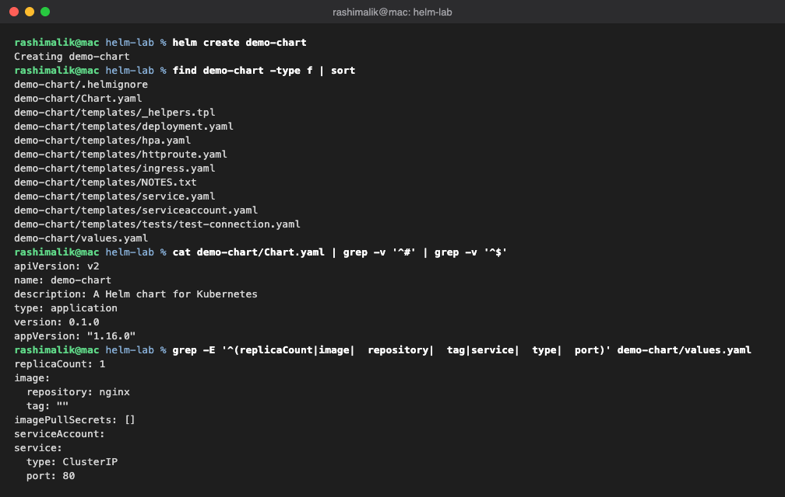

### Rendering Without Deploying

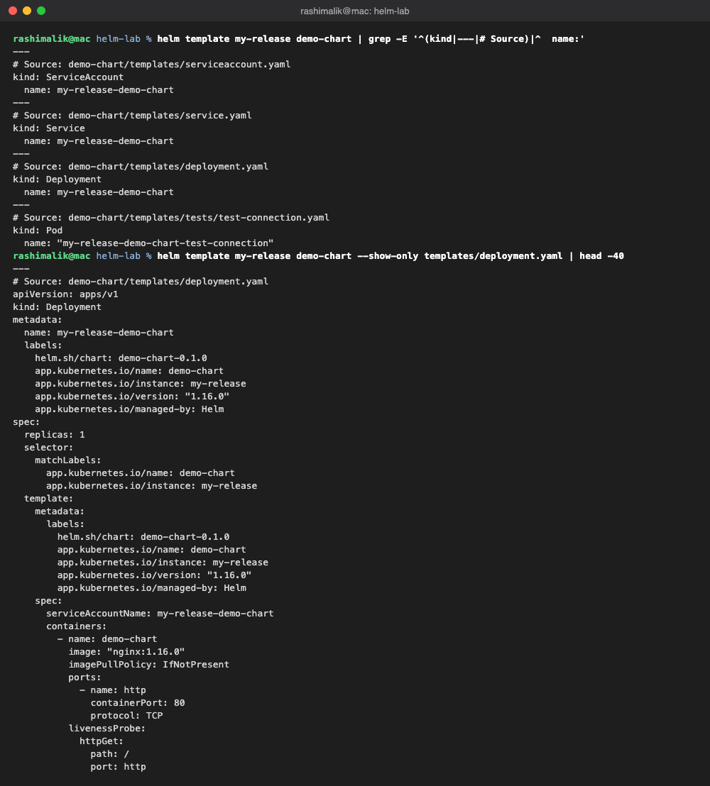

### Install, List and Uninstall

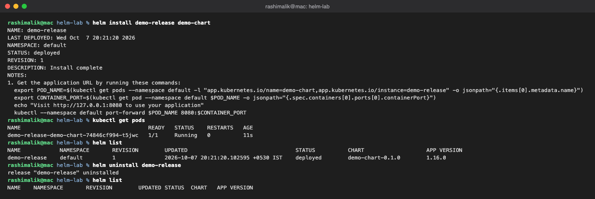

## 3. Chart Structure

```text
simple-chart/
├── Chart.yaml      chart metadata (name, version, appVersion)
├── values.yaml     default values
└── templates/      Kubernetes YAML with {{ }} placeholders
    ├── deployment.yaml
    └── service.yaml
```

`{{ .Release.Name }}` is replaced by the name given at install time and `{{ .Values.x }}` reads
from `values.yaml`. That's why installing as `my-release` produced `my-release-app` and
`my-release-svc`.

### Rendering the Chart

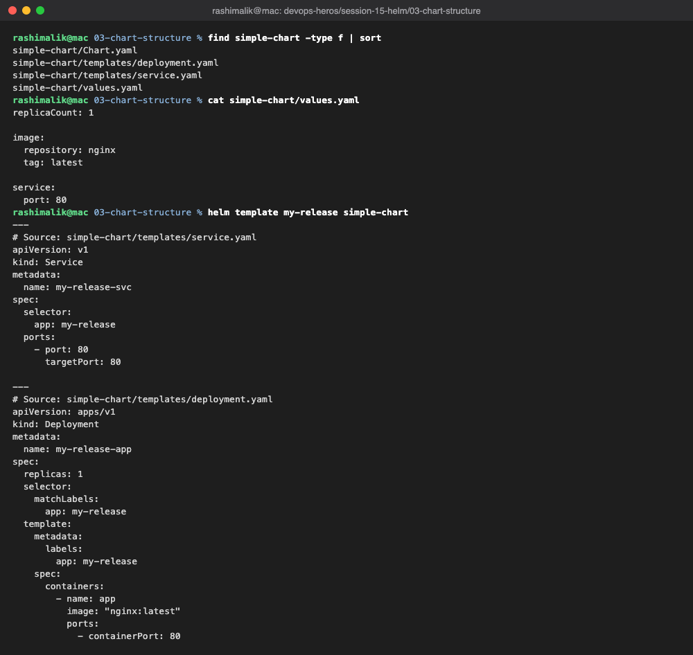

### Installing the Chart

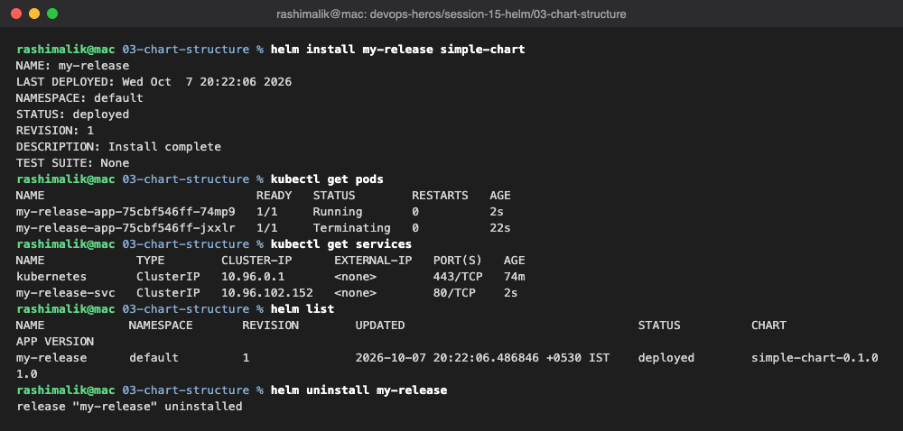

## 4. Chart.yaml

| Field | Meaning |
|---|---|
| `apiVersion: v2` | Chart API version, required for Helm 3+ |
| `name` | Chart name |
| `version` | Version of the **chart**; bump it when the chart files change |
| `appVersion` | Version of the **application** inside, usually the image tag |
| `type` | `application` (installable) or `library` (shared helpers only) |
| `keywords`, `maintainers` | Optional metadata for searching and ownership |

`helm lint` checks the chart for errors. The only note was that an `icon` is recommended.

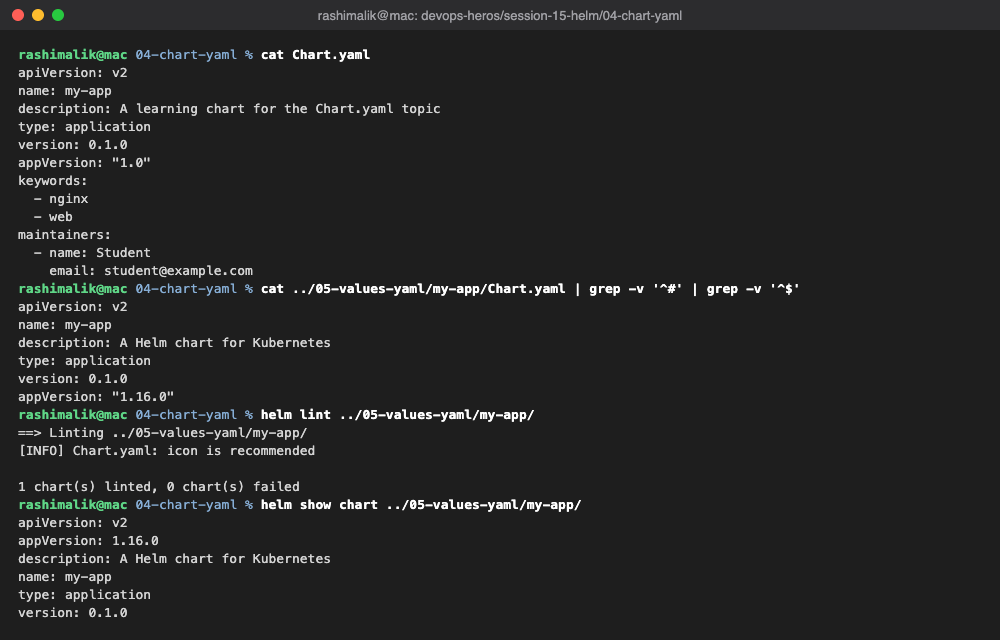

## 5. values.yaml

`values.yaml` holds the defaults, which can be overridden at install or upgrade time. Priority
from lowest to highest:

```text
values.yaml  <  -f values-prod.yaml  <  --set key=value
```

The screenshot shows all three: default 1 replica, `--set replicaCount=3` gives 3, the prod file
gives 5, and `-f values-prod.yaml --set replicaCount=2` gives 2 because `--set` wins.

- `-f` files are for environment configs and live in Git.
- `--set` is for quick one-off changes.

### Overriding at Install Time

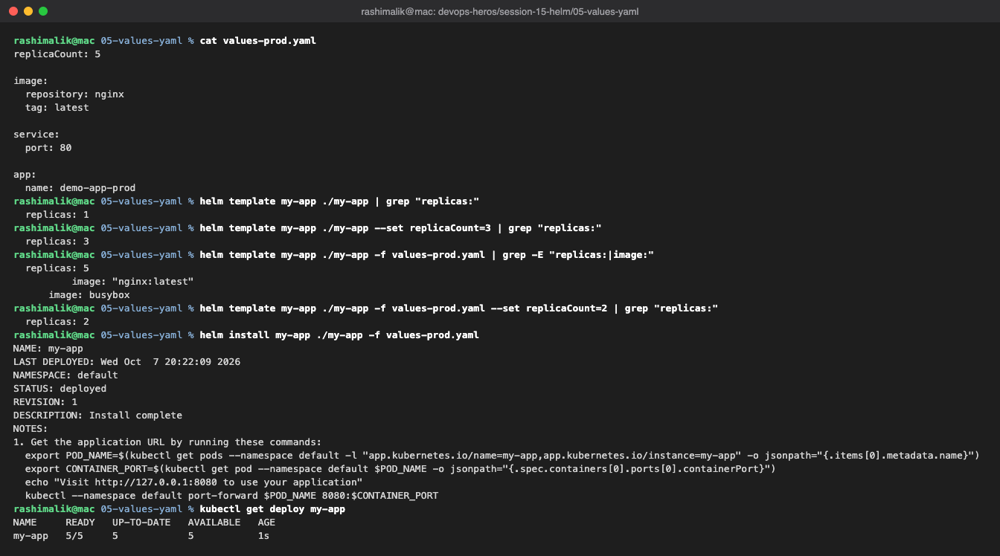

### Checking Rendered Values

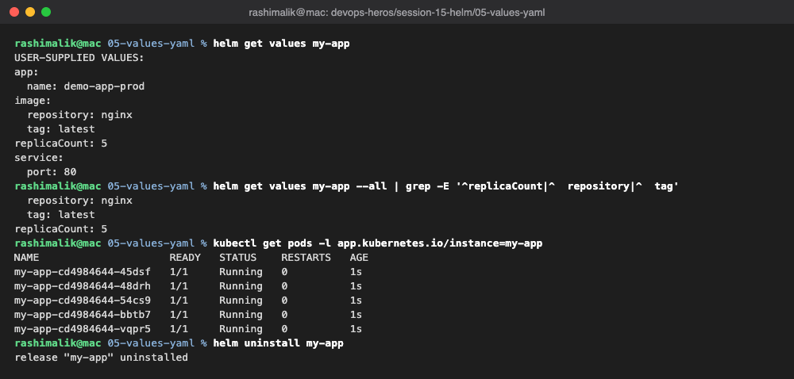

## 6. Templates

Templates are Kubernetes YAML plus Go template syntax. `service.yaml` is wrapped in
`{{- if .Values.service.enabled }} ... {{- end }}`, so with `--set service.enabled=false` the
Service disappears from the output and only the Deployment is rendered.

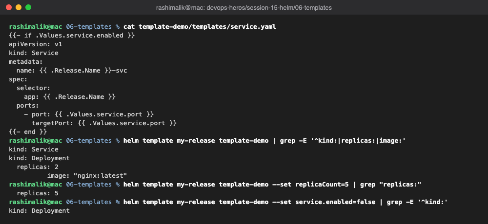

## 7. Install and Upgrade

Every install and upgrade creates a new **revision**, which is what makes rollback possible.

| Command | Behaviour |
|---|---|
| `helm install` | Fails if the release name already exists |
| `helm upgrade` | Fails if the release does not exist yet |
| `helm upgrade --install` | Installs if new, upgrades if it exists, so it is the one to use in CI/CD |

### Install

The second `helm install web-app` fails with "cannot reuse a name that is still in use".

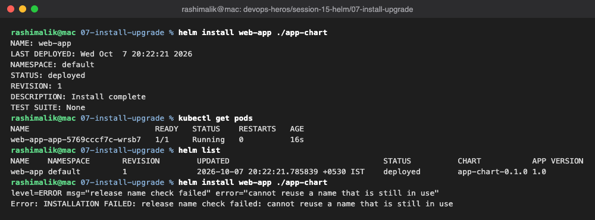

### Upgrade to 3 Replicas

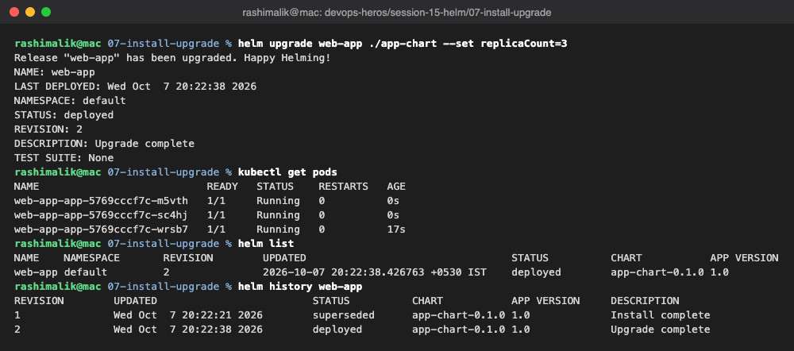

### Upgrade with --install

`helm upgrade web-app-new` failed because there was no such release, while
`helm upgrade --install web-app-new` installed it. Another thing I noticed: the plain
`upgrade --install web-app` went back to 1 replica. Values passed with `--set` in an earlier
upgrade are not remembered unless `--reuse-values` is used.

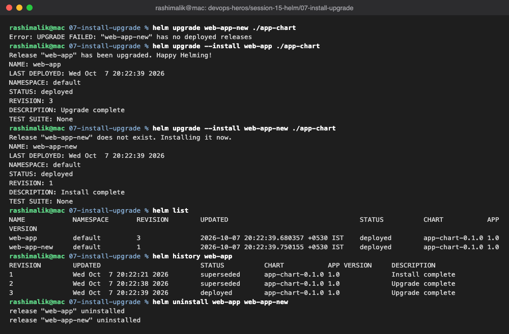

## 8. Rollback

- `helm history` lists every revision.
- `helm rollback <release> N` goes back to revision N **by creating a new revision**, so the
  history is never rewritten.
- `--atomic` rolls back automatically if the upgrade isn't healthy within `--timeout`. Helm 4
  prints that it is deprecated in favour of `--rollback-on-failure`, but it still works.

### Broken Upgrade

Upgrading to `image.tag=doesnotexist` is reported as "deployed" because Helm doesn't wait by
default. The new Pod is stuck in `ImagePullBackOff` while the old Pod keeps serving.

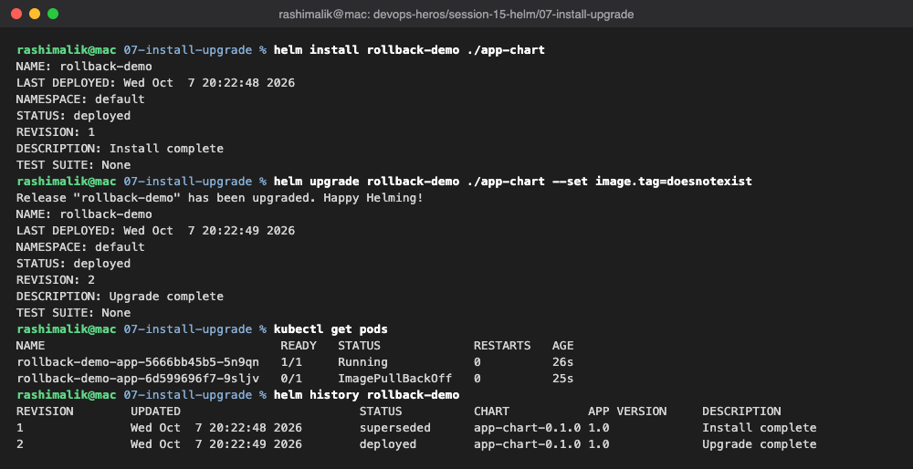

### Rollback to Revision 1

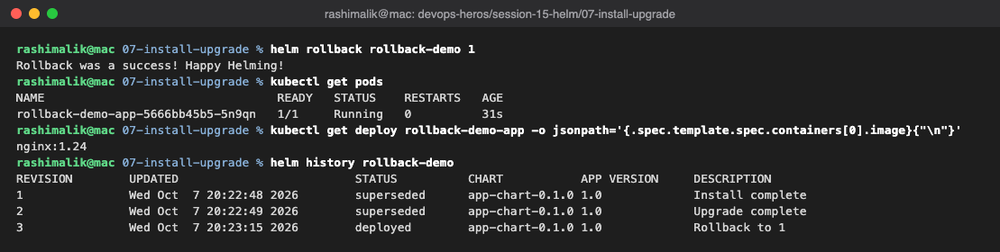

### Automatic Rollback with --atomic

The upgrade waited 60 seconds, failed, and Helm rolled back on its own: revision 4 is `failed`
and revision 5 is `Rollback to 3`.

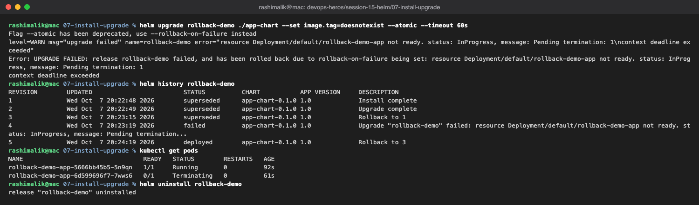

## 9. Deploying an Application

A guestbook chart with a Deployment, a NodePort Service (30080) and a ConfigMap whose values are
injected as environment variables, taken through the full lifecycle:

```text
lint  ->  template  ->  install  ->  upgrade  ->  history  ->  rollback  ->  uninstall
```

### Lint and Render

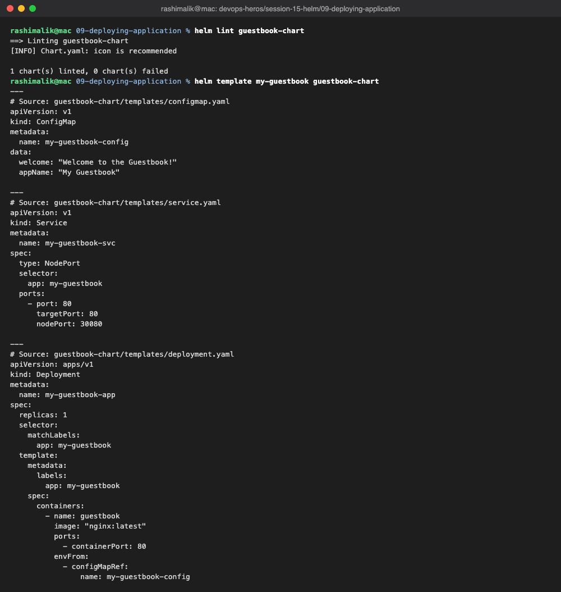

### Install and Verify

The ConfigMap values show up as `welcome` and `appName` env vars inside the Pod. On kind the
NodePort isn't reachable from macOS directly, so I tested port 30080 from inside the node container.

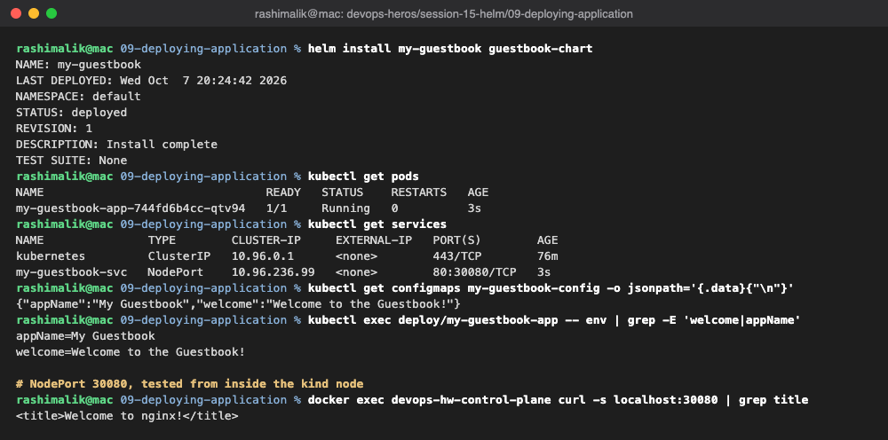

### Upgrade and History

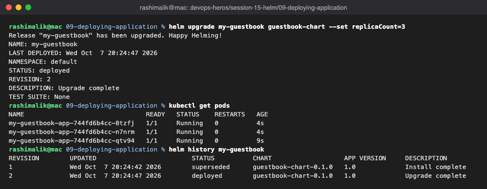

### Rollback and Clean Up

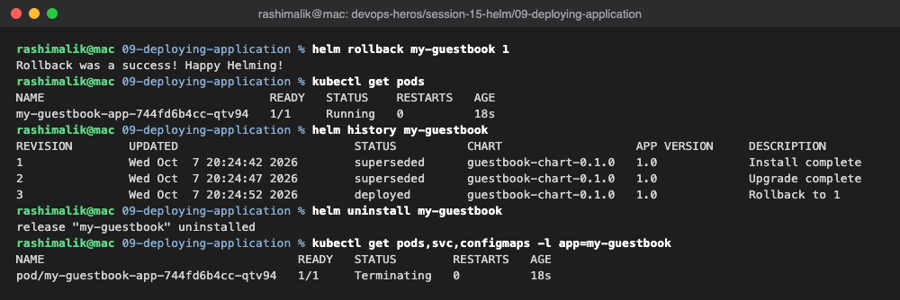

## 10. Mini Project: Notes App

`notes-chart` has development defaults in `values.yaml` (1 replica, `nginx:1.24`,
`ENVIRONMENT=development`) and production values in `values-prod.yaml` (3 replicas,
`nginx:1.25`, `ENVIRONMENT=production`).

### Lint and Render

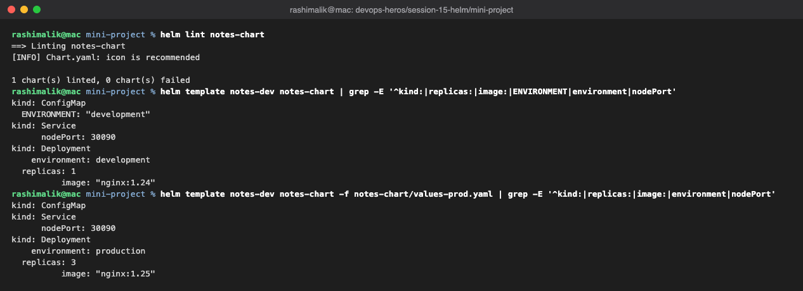

### Install (Development)

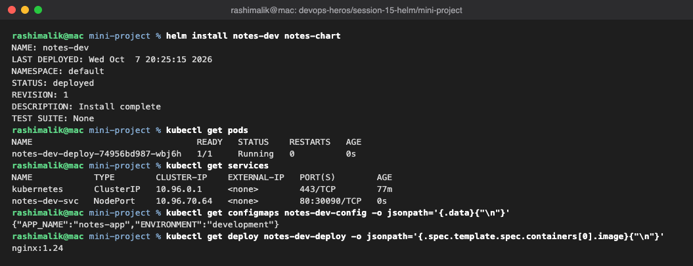

### Upgrade to Production Values

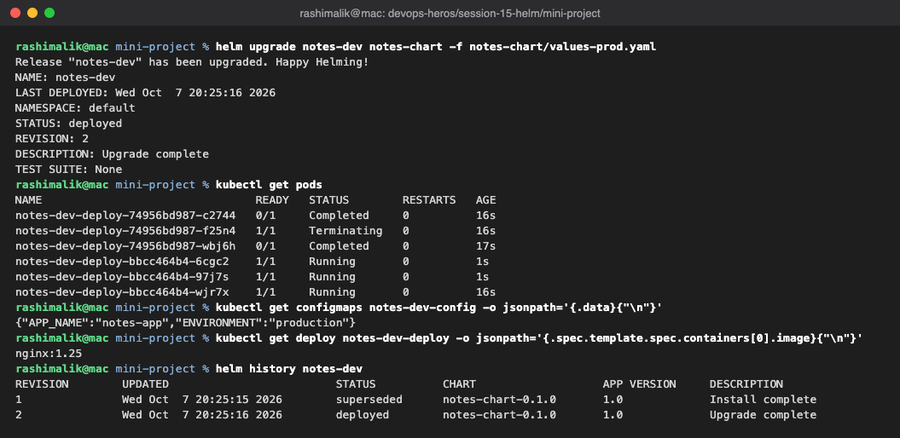

### Bad Upgrade

`helm upgrade notes-dev notes-chart --set image.tag=broken-tag-does-not-exist` was run without
`-f values-prod.yaml`, so everything else went back to the defaults (1 replica). The new Pod
can't pull its image.

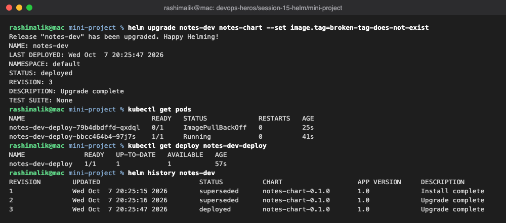

### Rollback to Revision 2

Rolling back to revision 2 brought back the whole production state, not just the image: 3
replicas, `nginx:1.25` and `ENVIRONMENT=production`.

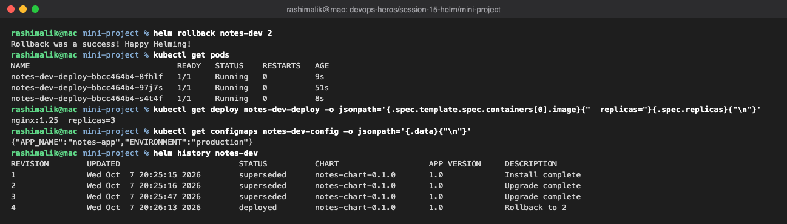

### Clean Up

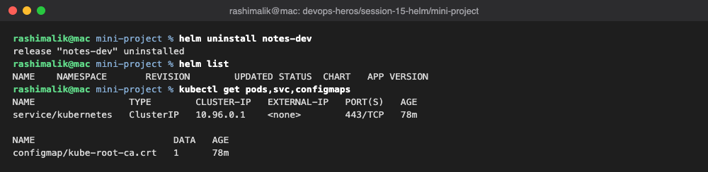

## Key Learnings

- A **chart** is written once and **values** adapt it to each environment.
- `helm lint` and `helm template` catch mistakes before anything reaches the cluster.
- Every install, upgrade and rollback is a numbered **revision**, so `helm rollback` can undo a
  bad release in one command.
- `helm upgrade` doesn't remember earlier `--set` values, so environment values belong in `-f`
  files kept in Git.
- `--atomic` / `--rollback-on-failure` makes Helm wait and undo a failed upgrade automatically.
