# Session 17: DevSecOps

**Submitted by:** Rashi
**Roll No:** 10389
**Batch:** B

DevSecOps puts security checks into every stage of the CI/CD pipeline instead of testing security
once at the end. A problem found by a scan in the pipeline costs minutes to fix; the same problem
found in production costs much more.

```text
Code -> Unit Tests -> SAST -> SCA -> Secret Scan -> Docker Build -> Image Scan -> Security Gate -> Push -> Deploy to Kubernetes
```

The session's demo app (a small Flask "DevSecOps Dashboard") was copied into its own GitHub
repository so the pipeline could run.

- **Repository:** https://github.com/RashiMalik02/hey-cicd
- **Pipeline runs:** https://github.com/RashiMalik02/hey-cicd/actions
- **Container image:** https://github.com/RashiMalik02/hey-cicd/pkgs/container/hey-cicd (`ghcr.io/rashimalik02/hey-cicd`)

**What I changed from the instructor's demo, and why**

| Change | Reason |
|---|---|
| Image pushed to **GHCR** instead of Docker Hub | Uses the built-in `GITHUB_TOKEN`, so no extra registry account or token secret is needed |
| Added a **Secret Scan – Gitleaks** job | The expected flow has a secret-scanning stage; the original pipeline had none |
| Trivy step turned into a real **gate** (`--exit-code 1 --ignore-unfixed`) | The original scan only printed results and could never stop the pipeline |
| Deploy job creates an image-pull secret for GHCR | So the kind cluster on the runner can pull the image |
| `pytest` 8.4.2 → 9.0.3 | Fix for PYSEC-2026-1845, found by my own SCA scan (section 3) |
| `debug=True` → `debug=os.environ.get("FLASK_DEBUG") == "1"` | Fix for the CodeQL alert `py/flask-debug` (section 6) |

## 1. Project Setup

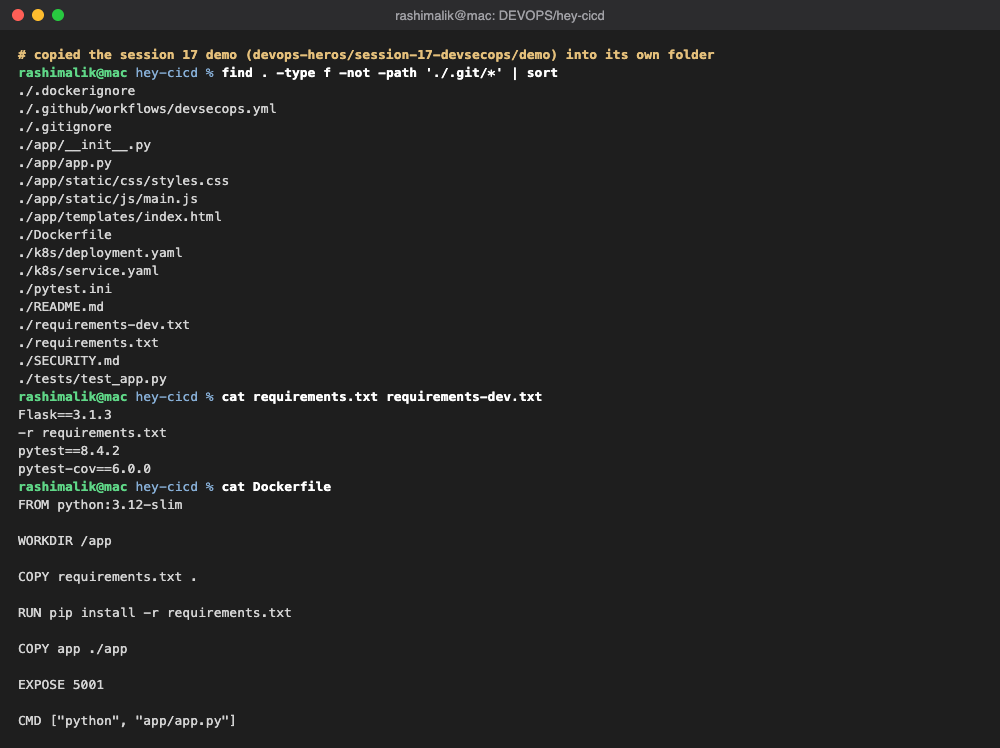

## 2. Running the App Locally

### Virtual Environment and Dependencies

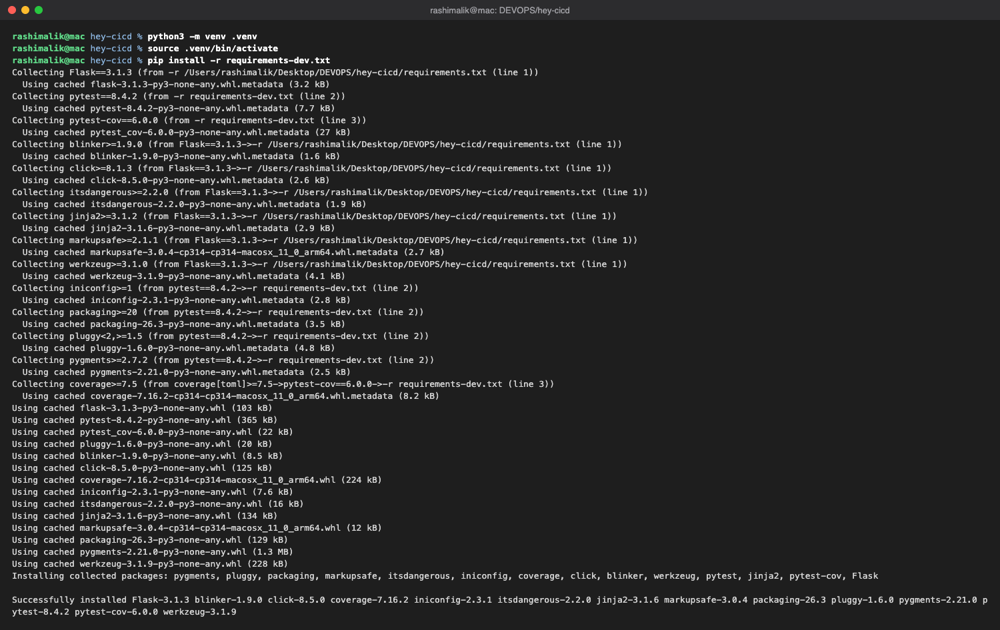

### Running the App

The app starts in Flask's development server with **debug mode on** and listens on all interfaces
(`0.0.0.0`). Locally that's convenient, but it also exposes the Werkzeug debugger (which can run
code) to anyone who can reach the port. CodeQL flagged exactly this later. My machine's LAN
address is masked in this screenshot.

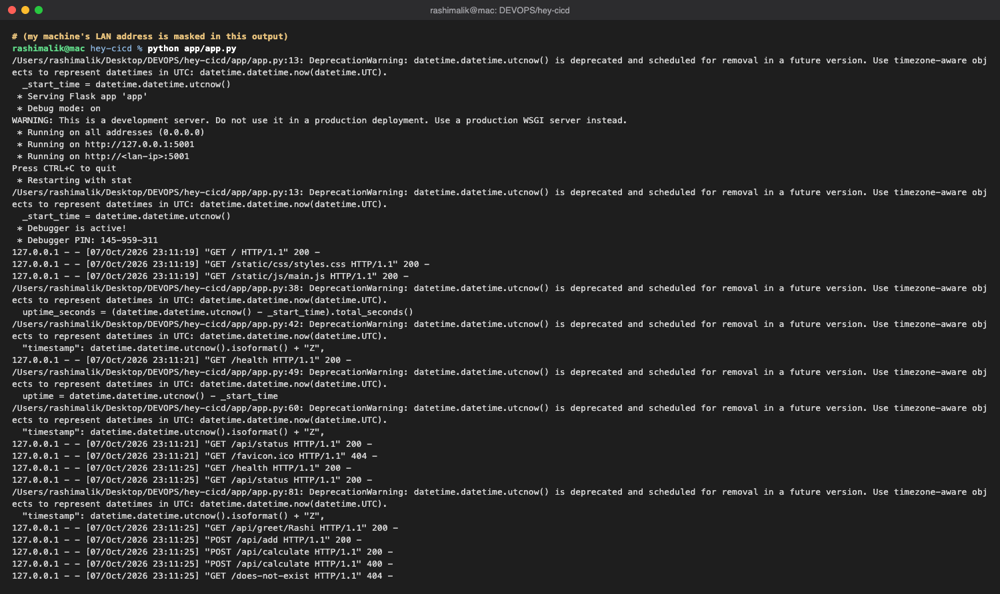

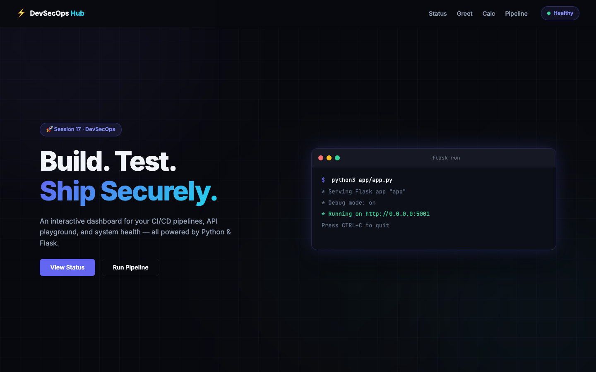

### Testing the API

Health, status, greeting, the add/calculate endpoints, input validation (`Division by zero`
returns 400) and the JSON 404 handler.

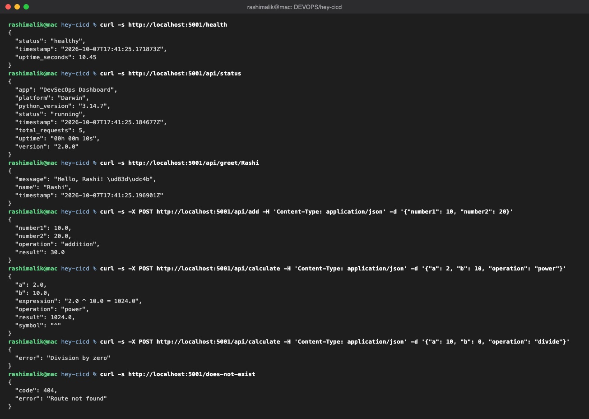

### Unit Tests with Coverage

8 tests pass with 69% line coverage. `--cov-report=term-missing` lists exactly which lines are
not tested (mostly the pipeline-simulator endpoint).

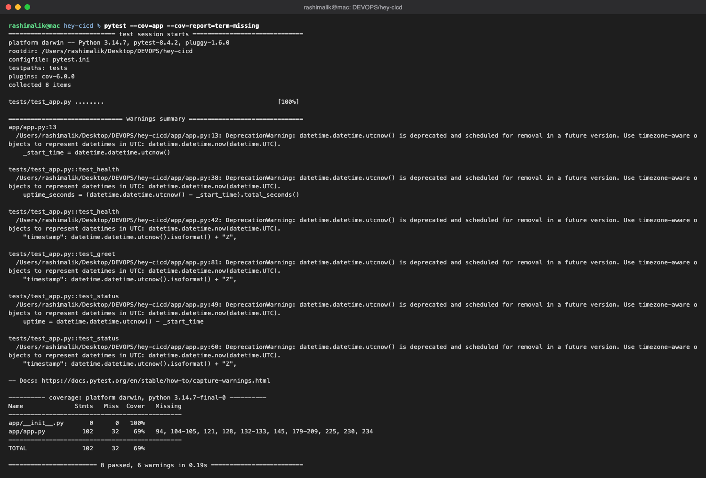

## 3. SCA (Software Composition Analysis)

SCA checks the **third-party packages** for known vulnerabilities (SAST checks our own code).
Tool: `pip-audit`.

The runtime dependencies in `requirements.txt` were clean, but auditing the whole environment
found **PYSEC-2026-1845 in `pytest` 8.4.2** (a dev dependency from `requirements-dev.txt`). I
followed the remediation flow: find the package and the fixed version (9.0.3), update
`requirements-dev.txt`, re-install, re-run the tests, scan again → no known vulnerabilities.

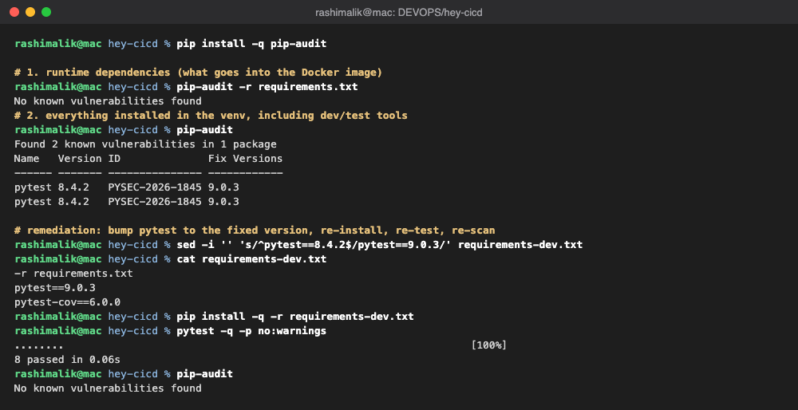

## 4. Running with Docker

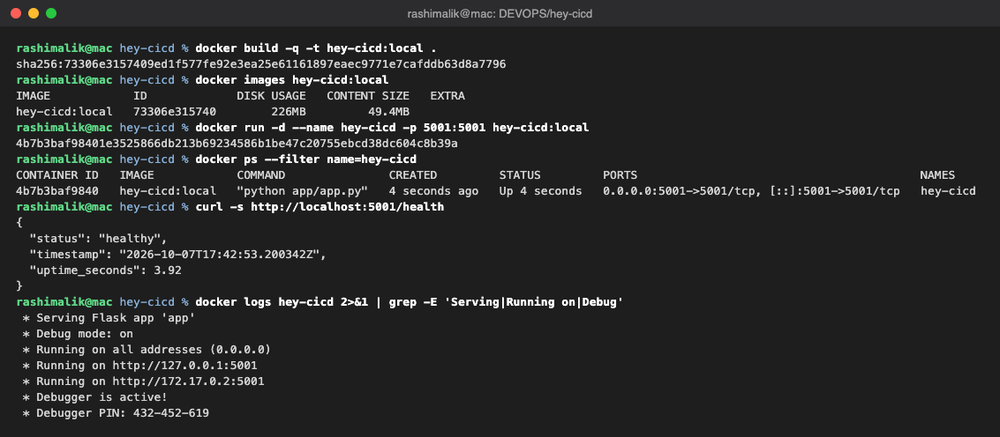

## 5. Container Image Scanning

The code can be clean while the image still contains vulnerable OS packages, so the built image is
scanned too. Tool: **Trivy** (v0.75, run from the official container image).

### Full Scan

165 findings, all in the Debian 13 base image of `python:3.12-slim` (plus 6 in the bundled `pip`).
Flask and the other app packages are clean.

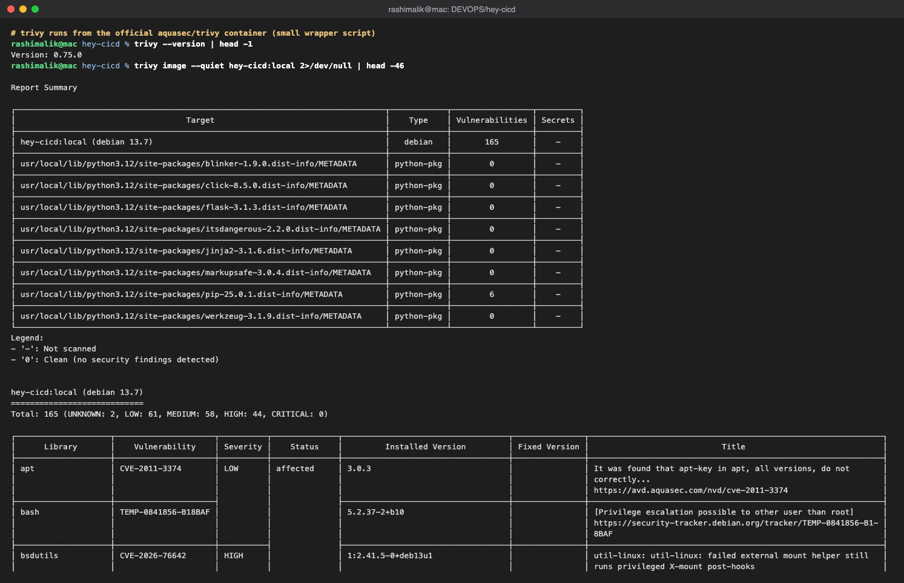

### HIGH and CRITICAL Only

44 HIGH, 0 CRITICAL, all `affected` with an empty **Fixed Version** column: Debian hasn't
released fixes for them yet.

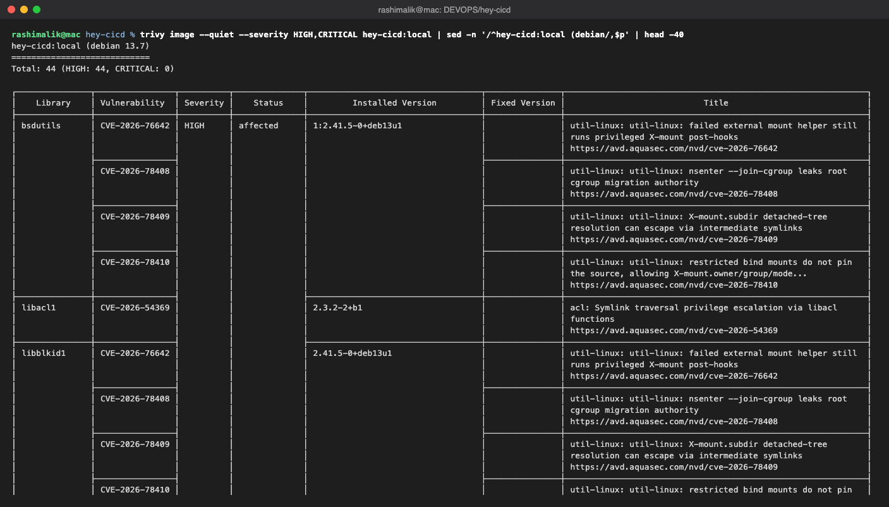

### Scan as a Gate (--exit-code 1)

`--exit-code 1` makes Trivy return 1 when it finds something, which fails the pipeline step and
stops the stages after it.

- **Gate 1**, fail on *any* HIGH/CRITICAL: exit code 1. Every build would be blocked by issues
  nobody can fix yet.
- **Gate 2**, add `--ignore-unfixed` to fail only on HIGH/CRITICAL that already have a fix: exit
  code 0. This is the gate I used in the pipeline. It blocks anything we *can* fix by rebuilding
  or updating, and doesn't block on things we can't.

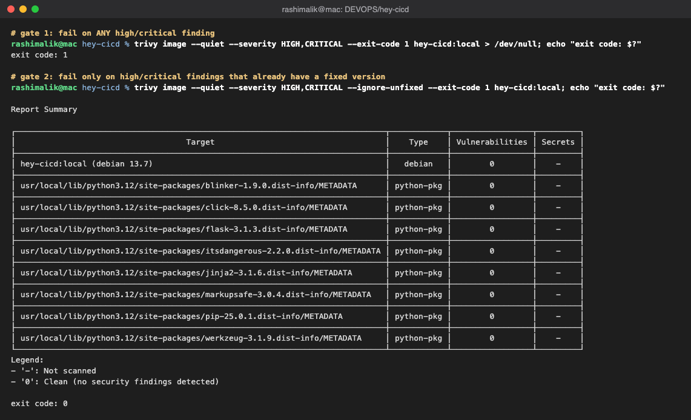

## 6. DevSecOps Pipeline (GitHub Actions)

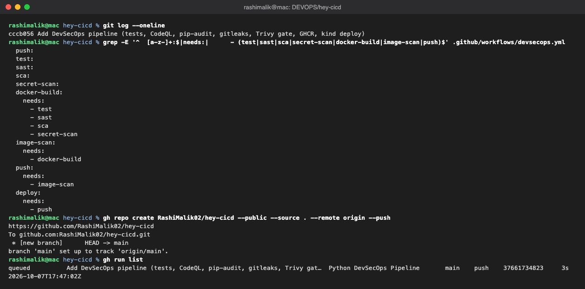

Eight jobs. `docker-build` needs `test`, `sast`, `sca` and `secret-scan`, so no image is built
until all four pass, and every later job needs the one before it.

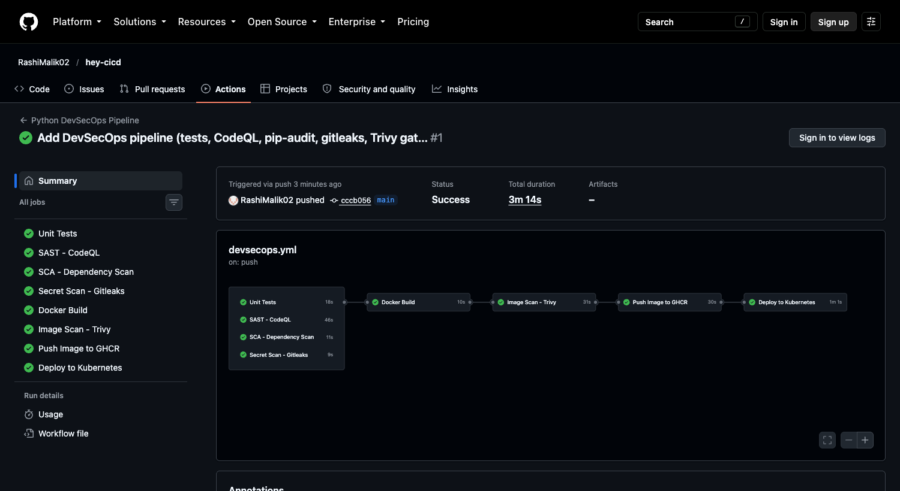

### SAST (Static Application Security Testing)

SAST analyses the **source code** without running it. Tool: **GitHub CodeQL**; results go to the
repository's Security tab. CodeQL found one real **high** severity issue, `py/flask-debug`
("Flask app is run in debug mode") at `app/app.py:234`, which is the same problem I noticed in
section 2. The fix is in [Fixing the SAST Finding](#fixing-the-sast-finding).

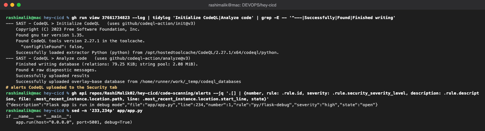

### SCA in the Pipeline

The pipeline's `pip-audit` scans what the job installed (`requirements.txt` + the audit tool): no
known vulnerabilities. The Unit Tests job already installs the patched `pytest-9.0.3`.

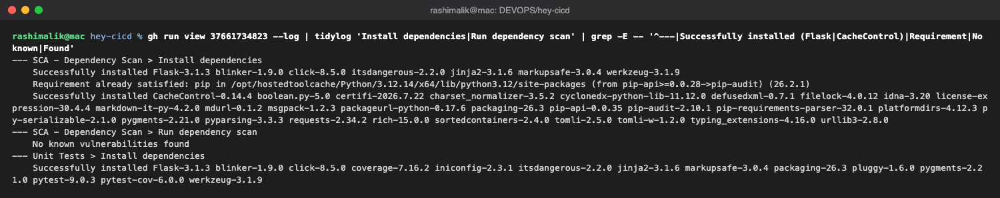

### Image Scan in the Pipeline

Same result as locally: the full report shows 44 HIGH (unfixed), and the gate step
(fixable only) finds 0, so it passes.

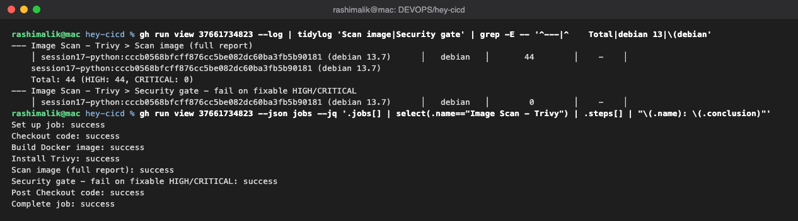

## 7. Container Registry

A registry stores the built image so Kubernetes can pull it. The pipeline logs in to GHCR with the
job's own `GITHUB_TOKEN` (`permissions: packages: write`) and pushes two tags: the commit SHA (an
exact, immutable version to deploy or roll back to) and `latest`. No password is stored anywhere.

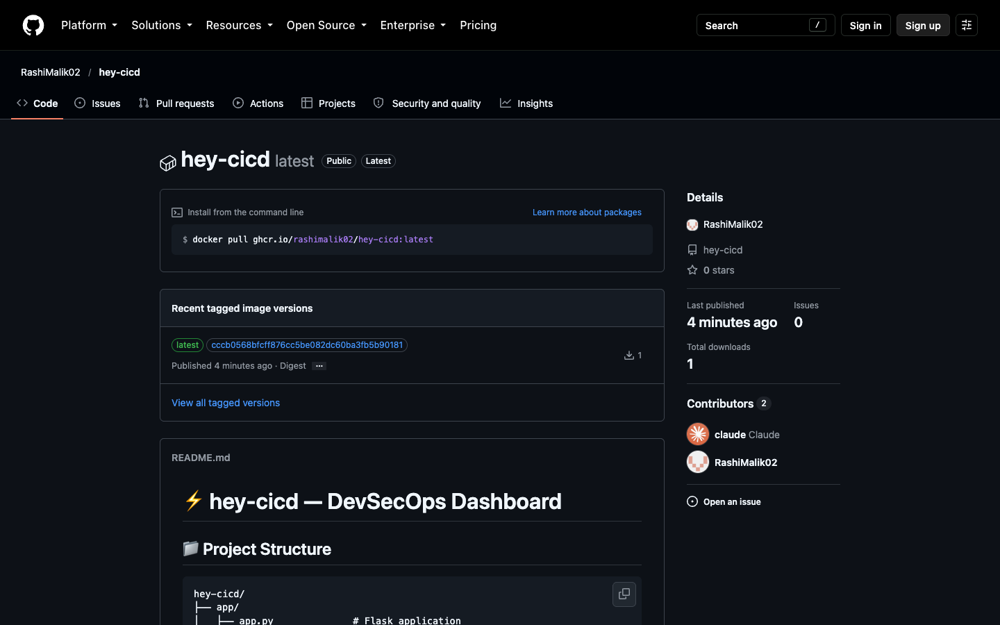

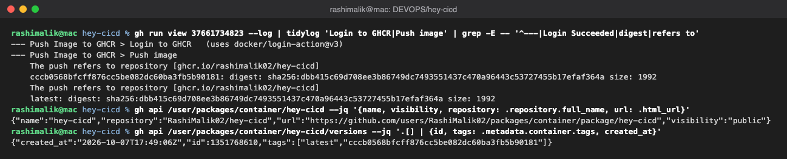

## 8. Deploy in the Pipeline

The deploy job creates a temporary kind cluster on the runner, swaps `__IMAGE_TAG__` for the commit
SHA, adds a pull secret for GHCR, applies the manifests, waits for the rollout and calls the app
with `curl`. It only runs on a push to `main`, never on pull requests.

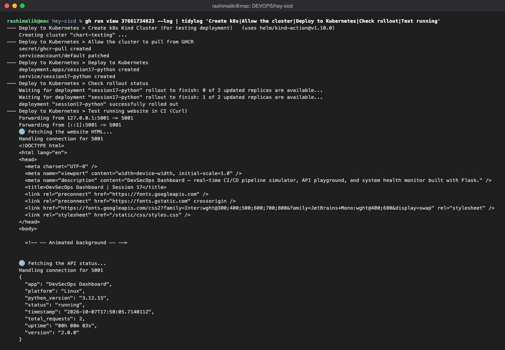

## 9. Secret Scanning

Secrets (API keys, passwords, tokens) must never be committed. A leaked real secret must be
**revoked and rotated**; deleting the line isn't enough, because it stays in Git history.

- In the pipeline, **gitleaks** scans the full Git history (`fetch-depth: 0`): no leaks.
- On GitHub, **secret scanning** and **push protection** are enabled for the repository. Push
  protection rejects a push that contains a known token format before it lands.

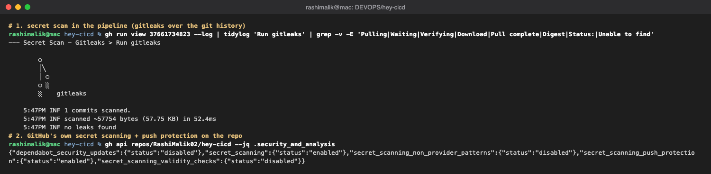

To see the gate actually trigger, I ran gitleaks on a scratch folder (not part of any repo) holding
a fake GitHub token: it reported the `github-pat` rule, redacted the value, and exited with code 1.
In the pipeline that would fail the job.

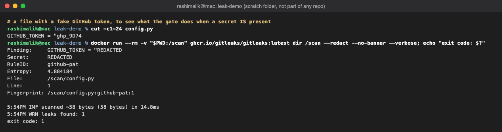

## 10. Kubernetes Deployment (Local)

### Applying the Manifests

The manifest has the placeholder tag `__IMAGE_TAG__`, which the pipeline replaces. Applied as-is,
the Pods can't pull it: `ErrImagePull` / `ImagePullBackOff` with "not found".

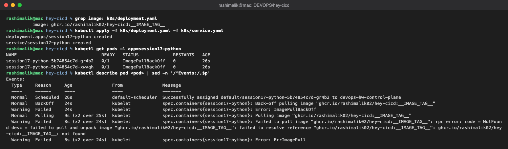

### Updating the Image and Watching the Rollout

`kubectl set image` with the SHA tag the pipeline pushed triggers a rolling update, and
`kubectl rollout status` waits until both new Pods are running. The image is pulled straight from
GHCR, since the package is public.

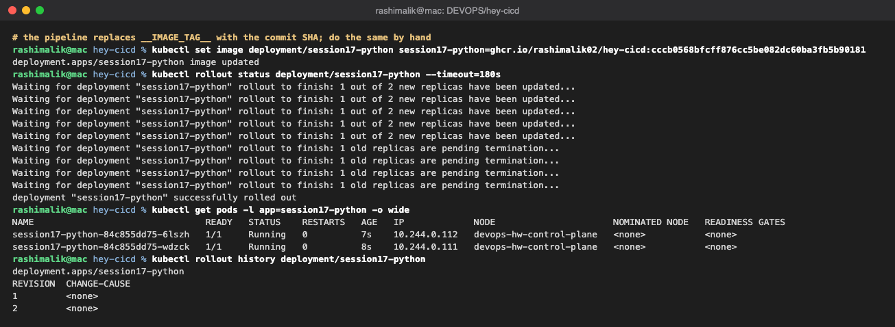

### Accessing the App

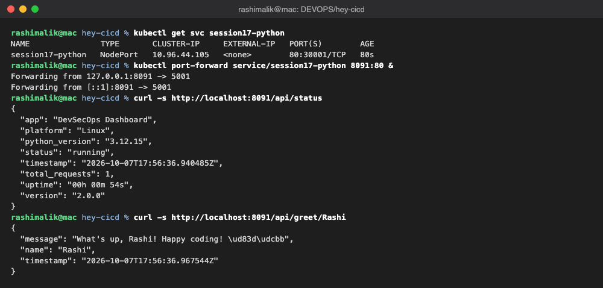


## Fixing the SAST Finding

Debug mode is now off unless `FLASK_DEBUG=1` is set. The tests still pass, and on the next pipeline
run CodeQL marked alert #1 as **fixed**. That run also pushed a new image tag (`bbc0b72…`), which
is now `latest`.

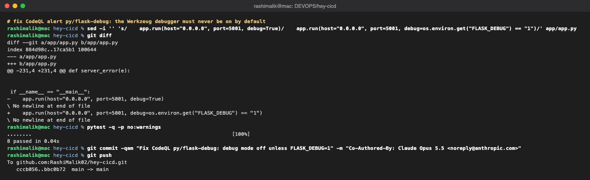

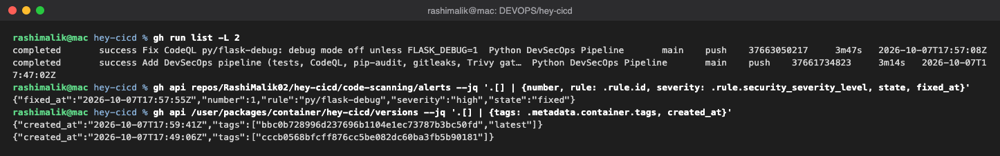


## 11. Security Gates

A scan *finds* problems; a **gate** decides whether the pipeline is allowed to continue.

| Check | Tool | Gate behaviour in this pipeline |
|---|---|---|
| Unit tests | pytest | Any failing test fails the job, so nothing gets built |
| SAST | CodeQL | Results go to the Security tab. A branch ruleset can block merges on high alerts |
| SCA | pip-audit | Exits non-zero on a known vulnerable dependency, so the build is blocked |
| Secret scanning | gitleaks + GitHub push protection | Leak found = exit 1; push protection rejects the push |
| Image scan | Trivy `--exit-code 1 --ignore-unfixed` | Fixable HIGH/CRITICAL blocks the push to the registry |
| Rollout | `kubectl rollout status --timeout` | A rollout that doesn't become ready fails the deploy |

## Key Learnings

- Security works best as many small automatic checks inside the pipeline, each blocking the next
  stage.
- SAST looks at my code, SCA at my dependencies, image scanning at everything in the container,
  and secret scanning at what's in Git. Each found something the others couldn't.
- A gate has to be strict about what can be fixed and realistic about what can't
  (`--ignore-unfixed`), otherwise people just turn it off.
- Using the job's own `GITHUB_TOKEN` for the registry means there's no long-lived password to
  leak.
