# Session 21: DevOps Final Capstone, TaskBoard Demo

**Submitted by:** Rashi
**Roll No:** 10389
**Batch:** B

TaskBoard is the reference project for the capstone: a small task management app with a React
frontend, a FastAPI backend and PostgreSQL. In this demo I ran the whole app locally with Docker
Compose, used it through the UI and the API, checked its health endpoints, metrics and database,
and ran its tests. Code: [session21-python](../../session21-python/).

```text
Browser -> Frontend (React, nginx :3000) -> /api -> Backend (FastAPI :8000) -> PostgreSQL :5432
```

## 1. The Application

- **Frontend:** React + Vite dashboard, built in a multi-stage Dockerfile and served by nginx. The
  browser only calls `/api/...` and nginx forwards it to the backend, so the browser never needs
  the backend's address.
- **Backend:** FastAPI with SQLAlchemy. Alembic migrations run before Uvicorn starts.
- **Endpoints for operations:** `/health` (liveness, no DB), `/ready` (readiness, checks the
  DB), `/metrics` (Prometheus format).

## 2. Running Locally with Docker Compose

One command builds both images and starts frontend, backend and PostgreSQL together.

### Compose Up

The first `docker compose up -d` didn't fully work: the backend exited with
`Connection refused` to Postgres. `depends_on` only waits until the postgres **container** has
started, not until the database inside it is accepting connections, so the backend's migration ran
too early and crashed. Running `docker compose up -d` again started the backend once Postgres was
ready, and the migration `0001_create_tasks` ran.

The proper fix is a healthcheck on postgres plus
`depends_on: postgres: condition: service_healthy` on the backend (or a retry loop at startup),
so the order is guaranteed instead of relying on luck.

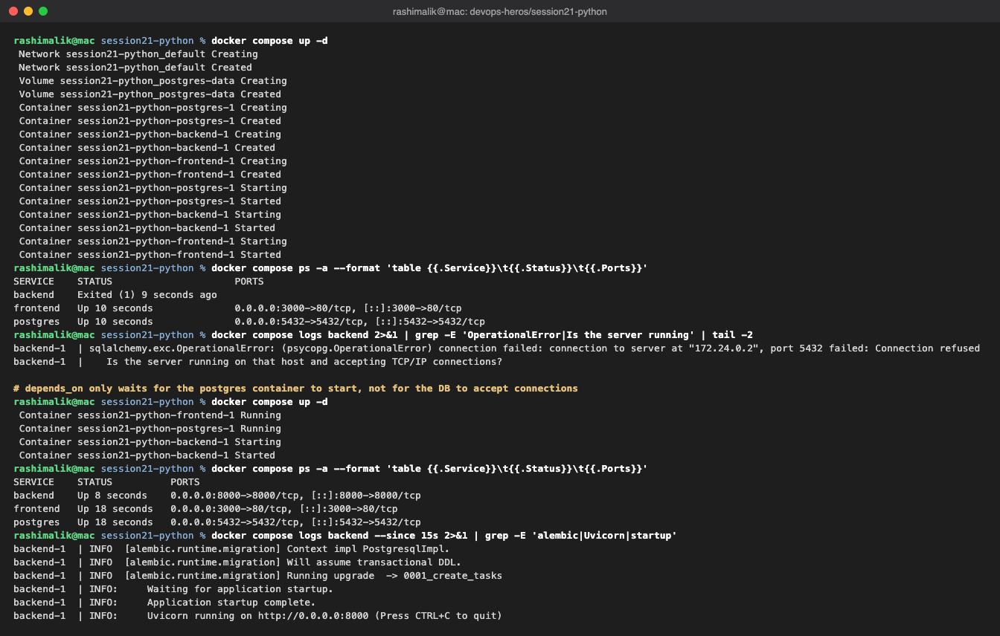

### TaskBoard Dashboard

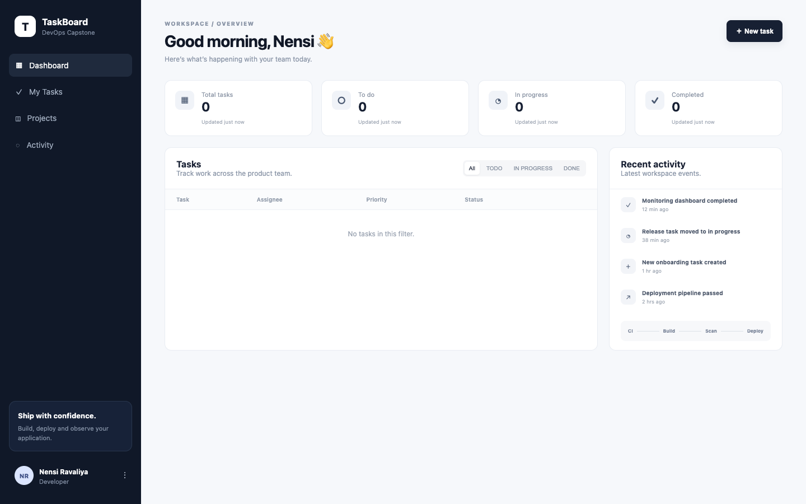

### Creating a Task

I created three tasks through the **New task** form.

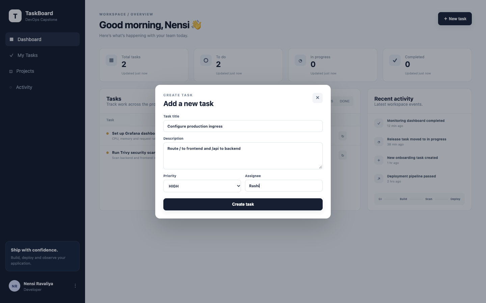

I found a frontend bug here. After clicking **Create task** the task is saved (`POST /api/tasks`
returns 201), but the modal stays open and the counters still show 0. In `create()` the code
calls `e.currentTarget.reset()` **after** `await fetch(...)`. By then React has set
`e.currentTarget` to `null`, so `reset()` throws and the lines after it (closing the modal and
reloading the list) never run. Closing the modal and refreshing shows the task. The fix is to save
`const form = e.currentTarget` before the `await` and call `form.reset()` afterwards.

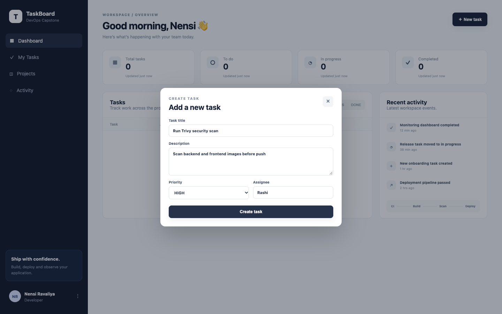

After creating all three and refreshing:

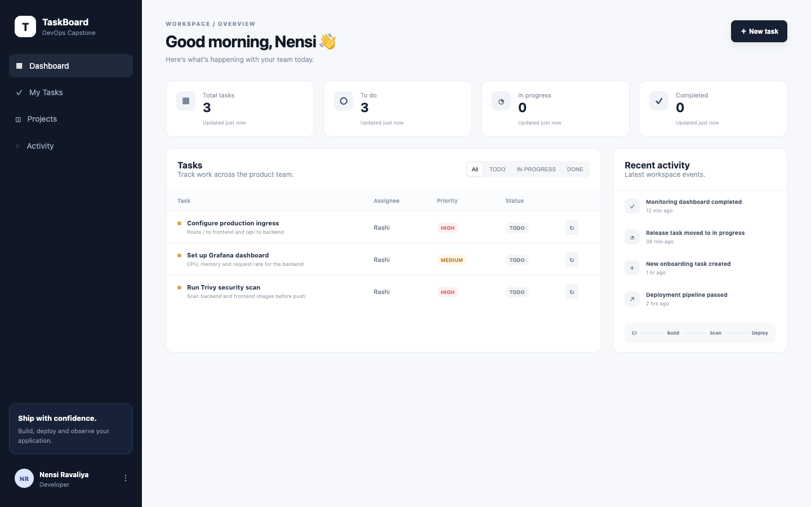

### API Docs (Swagger)

FastAPI generates interactive API docs at `/docs` from the code.

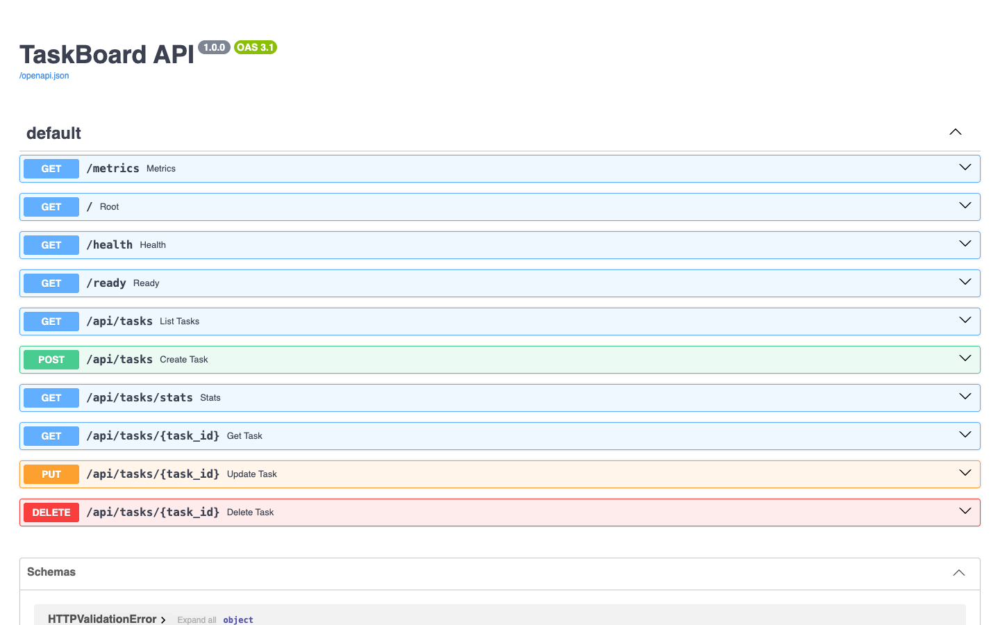

Updating a task through the API (`PUT /api/tasks/2`, status `IN_PROGRESS`). Only the fields sent
are changed, and the stats endpoint reflects it immediately:

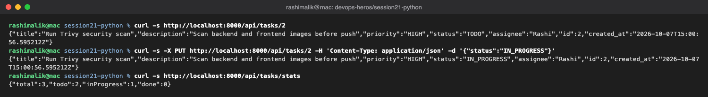

### Health and Metrics

`/health` returns `UP` without touching the database, while `/ready` also checks the database.
That split is what Kubernetes liveness and readiness probes need. The same API also works through
the frontend on `:3000/api/...`. `/metrics` exposes request counts per endpoint and method,
latency histograms and process memory for Prometheus to scrape.

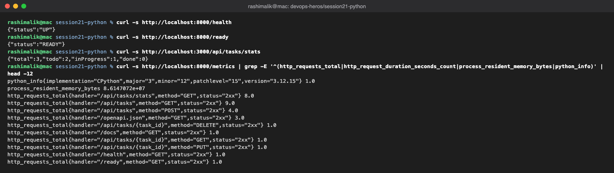

### Tasks Table in PostgreSQL

The data is really in Postgres: the `tasks` table created by Alembic (`alembic_version` =
`0001_create_tasks`) holds the three tasks, including the status change made through the API.

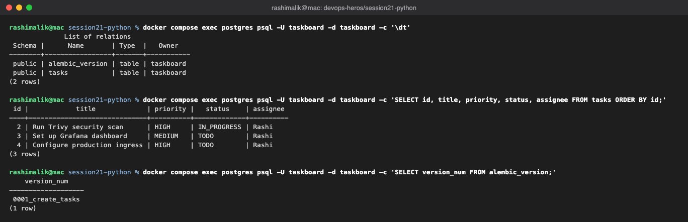

### Docker Images

The second build is fully `CACHED`, because nothing in the build context changed. The backend
image runs as a non-root user (UID 10001, confirmed with `id` inside the running container). The
frontend uses a multi-stage build: Node builds the static files, and only nginx plus the built
files end up in the final image (76 MB vs 325 MB for the Python backend).

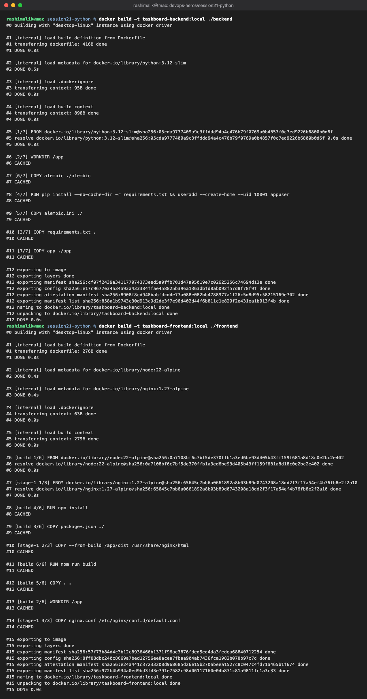

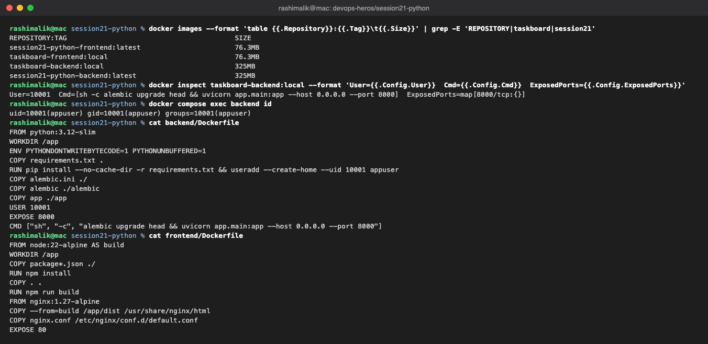

## 3. Testing with Pytest

Tests are the first quality gate. They use a separate SQLite database (`DATABASE_URL` is
overridden in the test file), never the real one. My Mac has Python 3.14 and the pinned
dependencies have no wheels for it, so I ran the tests in `python:3.12-slim`, the same base image
the backend Dockerfile uses.

On a fresh copy of the code, `test_create_task_validation` failed with
`no such table: tasks`. The tables are created in a FastAPI `startup` event, but the test makes
`client = TestClient(app)` without a `with` block. Starlette only runs startup events inside
`with TestClient(app) as client:`, so the tables were never created. With
`Base.metadata.create_all(bind=engine)` added to the test module (applied inside the container,
the repo file is unchanged), all 3 tests pass. In a CI pipeline this failure would correctly
stop the build before any image is pushed.

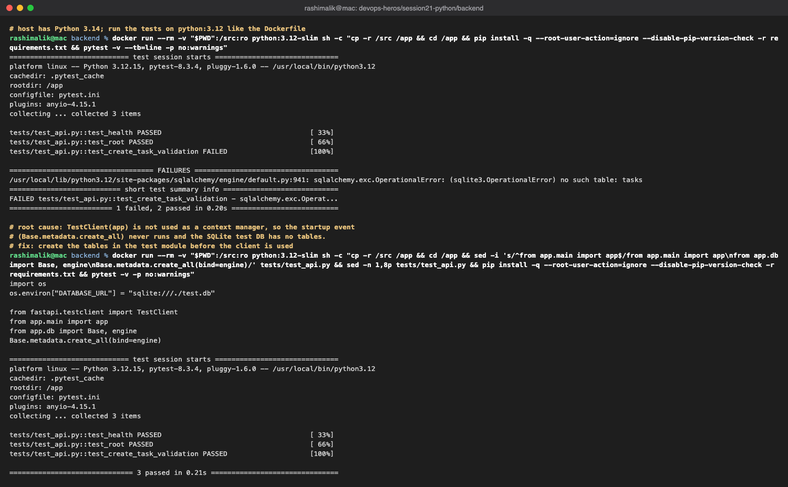

## Key Learnings

- Docker Compose runs the whole stack with one command, but `depends_on` alone doesn't wait for
  a service to be *ready*. That needs healthchecks.
- nginx forwarding `/api` means the frontend and backend can be deployed and scaled separately.
- `/health`, `/ready` and `/metrics` give Kubernetes and Prometheus what they need.
- Running the app for real found two bugs (startup ordering, the frontend form) and the tests
  found a third (test DB never initialised). That's the point of testing before deploying.
