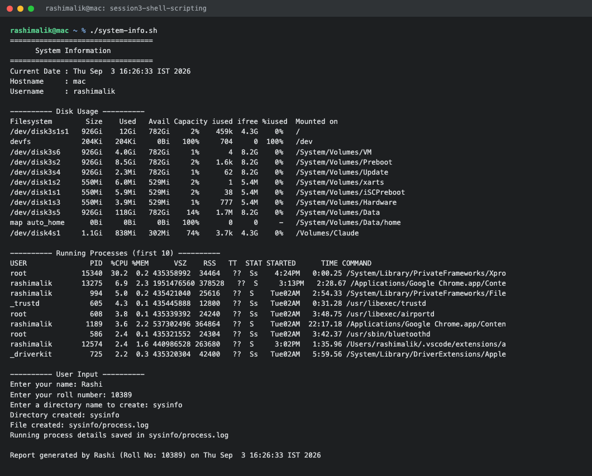
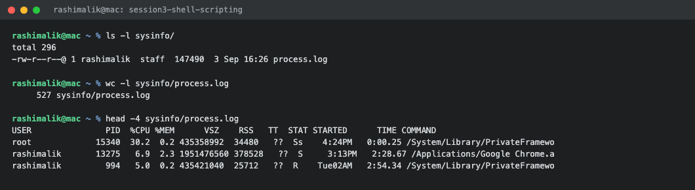

# Shell Scripting Homework

**Submitted by:** Rashi
**Roll No:** 10389
**Batch:** B

All commands below were run on macOS, so the output uses the macOS versions of the commands.

---

## Task: System Information Script

Script file: [system-info.sh](system-info.sh)

```bash
#!/bin/bash

# System Information Script
# Session 3 - Shell Scripting Homework

# Storing the system details inside variables
current_date=$(date)
host_name=$(hostname)
user_name=$(whoami)

echo "=================================="
echo "      System Information"
echo "=================================="

echo "Current Date : $current_date"
echo "Hostname     : $host_name"
echo "Username     : $user_name"

echo ""
echo "---------- Disk Usage ----------"
df -h

echo ""
echo "---------- Running Processes (first 10) ----------"
ps aux | head -10

echo ""
echo "---------- User Input ----------"
read -p "Enter your name: " name
read -p "Enter your roll number: " roll_no
read -p "Enter a directory name to create: " dir_name

# Creating the directory and the log file
mkdir -p "$dir_name"
echo "Directory created: $dir_name"

touch "$dir_name/process.log"
echo "File created: $dir_name/process.log"

# Saving the running process details into the file using output redirection
ps aux > "$dir_name/process.log"
echo "Running process details saved in $dir_name/process.log"

echo ""
echo "Report generated by $name (Roll No: $roll_no) on $current_date"```

---

## How to Run

```bash
chmod +x system-info.sh
./system-info.sh
```

---

## Output

The process list is long, so the command column has been trimmed to keep the output readable.

```console
$ ./system-info.sh
==================================
      System Information
==================================
Current Date : Thu Sep  3 16:26:33 IST 2026
Hostname     : mac
Username     : rashimalik

---------- Disk Usage ----------
Filesystem        Size    Used   Avail Capacity iused ifree %iused  Mounted on
/dev/disk3s1s1   926Gi    12Gi   782Gi     2%    459k  4.3G    0%   /
devfs            204Ki   204Ki     0Bi   100%     704     0  100%   /dev
/dev/disk3s6     926Gi   4.0Gi   782Gi     1%       4  8.2G    0%   /System/Volumes/VM
/dev/disk3s2     926Gi   8.5Gi   782Gi     2%    1.6k  8.2G    0%   /System/Volumes/Preboot
/dev/disk3s4     926Gi   2.3Mi   782Gi     1%      62  8.2G    0%   /System/Volumes/Update
/dev/disk1s2     550Mi   6.0Mi   529Mi     2%       1  5.4M    0%   /System/Volumes/xarts
/dev/disk1s1     550Mi   5.9Mi   529Mi     2%      38  5.4M    0%   /System/Volumes/iSCPreboot
/dev/disk1s3     550Mi   3.9Mi   529Mi     1%     777  5.4M    0%   /System/Volumes/Hardware
/dev/disk3s5     926Gi   118Gi   782Gi    14%    1.7M  8.2G    0%   /System/Volumes/Data
map auto_home      0Bi     0Bi     0Bi   100%       0     0     -   /System/Volumes/Data/home
/dev/disk4s1     1.1Gi   838Mi   302Mi    74%    3.7k  4.3G    0%   /Volumes/Claude

---------- Running Processes (first 10) ----------
USER               PID  %CPU %MEM      VSZ    RSS   TT  STAT STARTED      TIME COMMAND
root             15340  30.2  0.2 435358992  34464   ??  Ss    4:24PM   0:00.25 /System/Library/PrivateFrameworks/Xpro
rashimalik       13275   6.9  2.3 1951476560 378528   ??  S     3:13PM   2:28.67 /Applications/Google Chrome.app/Conte
rashimalik         994   5.0  0.2 435421040  25616   ??  S    Tue02AM   2:54.33 /System/Library/PrivateFrameworks/File
_trustd            605   4.3  0.1 435445888  12800   ??  Ss   Tue02AM   0:31.28 /usr/libexec/trustd
root               608   3.8  0.1 435339392  24240   ??  Ss   Tue02AM   3:48.75 /usr/libexec/airportd
rashimalik        1189   3.6  2.2 537302496 364864   ??  S    Tue02AM  22:17.18 /Applications/Google Chrome.app/Conten
root               586   2.4  0.1 435321552  24304   ??  Ss   Tue02AM   3:42.37 /usr/sbin/bluetoothd
rashimalik       12574   2.4  1.6 440986528 263680   ??  S     3:02PM   1:35.96 /Users/rashimalik/.vscode/extensions/a
_driverkit         725   2.2  0.3 435320304  42400   ??  Ss   Tue02AM   5:59.56 /System/Library/DriverExtensions/Apple

---------- User Input ----------
Enter your name: Rashi
Enter your roll number: 10389
Enter a directory name to create: sysinfo
Directory created: sysinfo
File created: sysinfo/process.log
Running process details saved in sysinfo/process.log

Report generated by Rashi (Roll No: 10389) on Thu Sep  3 16:26:33 IST 2026```



---

## Verifying the Created Directory and File

```console
$ ls -l sysinfo/
total 296
-rw-r--r--@ 1 rashimalik  staff  147490  3 Sep 16:26 process.log

$ wc -l sysinfo/process.log
     527 sysinfo/process.log

$ head -4 sysinfo/process.log
USER               PID  %CPU %MEM      VSZ    RSS   TT  STAT STARTED      TIME COMMAND
root             15340  30.2  0.2 435358992  34480   ??  Ss    4:24PM   0:00.25 /System/Library/PrivateFramewo
rashimalik       13275   6.9  2.3 1951476560 378528   ??  S     3:13PM   2:28.67 /Applications/Google Chrome.a
rashimalik         994   5.0  0.2 435421040  25712   ??  R    Tue02AM   2:54.34 /System/Library/PrivateFramewo```

The directory `sysinfo` was created, `process.log` was created inside it, and the full running
process list was written into that file through `>` redirection.



---

## Commands Used and What They Do

| Command | What it does in this script |
| :--- | :--- |
| `date` | Prints the current system date and time |
| `hostname` | Prints the name of the machine |
| `whoami` | Prints the currently logged in username |
| `df -h` | Shows disk usage of all mounted filesystems in human readable form |
| `ps aux` | Lists all running processes with user, PID, CPU and memory usage |
| `read -p` | Shows a prompt and stores whatever the user types into a variable |
| `mkdir -p` | Creates the directory, and does not fail if it already exists |
| `touch` | Creates an empty file, or updates the timestamp if it exists |
| `>` | Redirects command output into a file instead of the terminal |
| `$(...)` | Command substitution, used to store command output inside a variable |

---

## What I Understood

- Variables are assigned without spaces around `=`, like `current_date=$(date)`, and are used
  later with `$current_date`.
- `$( )` runs a command and gives back its output, which is how the date, hostname and username
  are captured instead of being printed straight to the screen.
- `read -p "prompt" variable` is a cleaner way of taking input compared to printing a message with
  `echo` and then calling `read` separately.
- `>` overwrites the file every time, so each run of the script gives a fresh process list. If I
  wanted to keep appending to the same file I would use `>>` instead.
- Variables should be quoted like `"$dir_name"` so that directory names with spaces do not break
  the script.
