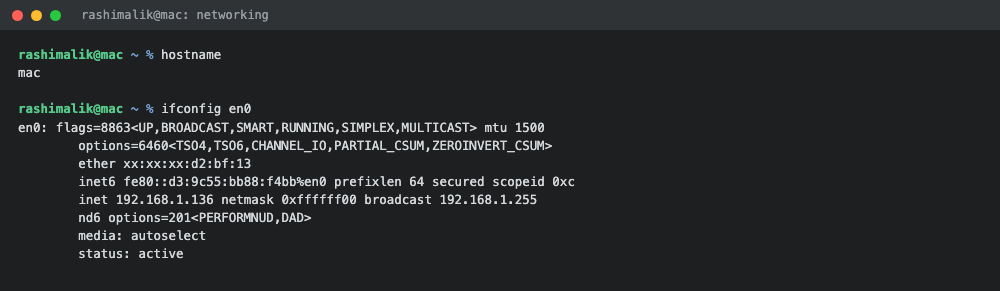
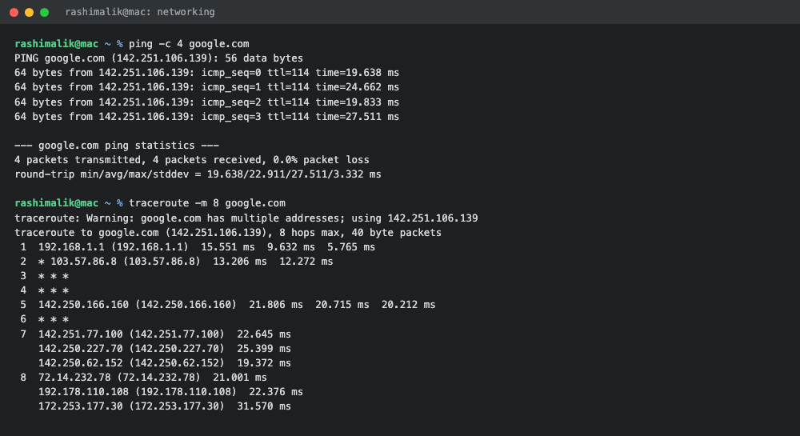
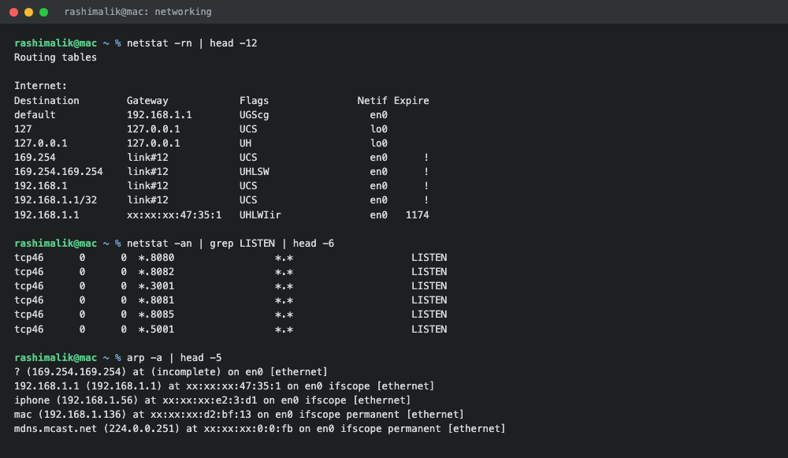
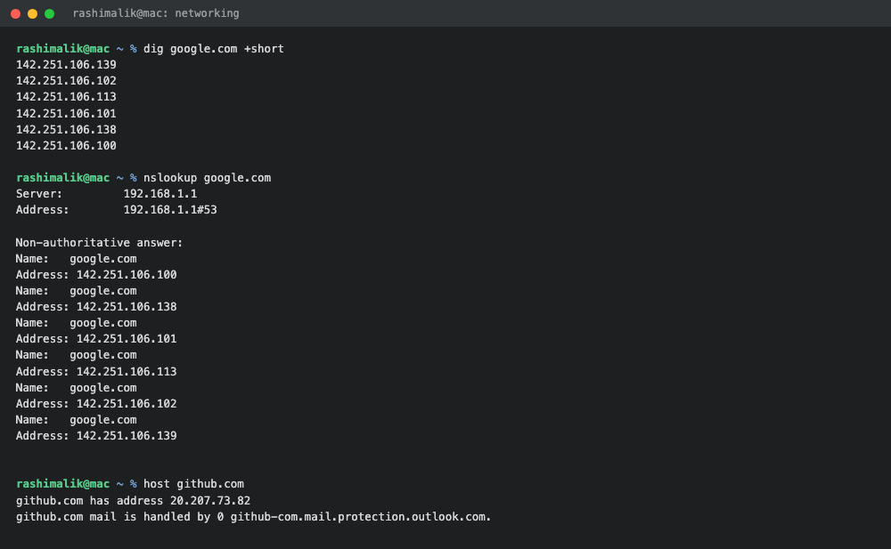

# Networking Homework

**Submitted by:** Rashi
**Roll No:** 10389
**Batch:** B

All commands were run on macOS, so the output uses the macOS versions of the commands, and the
Linux equivalent is written next to each one. MAC addresses are partially masked because this
repository is public.

---

## Task 1: Practice Commands from the Session

The IP addressing and subnetting notes from the session are in [ip.md](ip.md), and the reference
repositories shared in class are listed in [resources.md](resources.md).

---

## Task 2: Networking Commands with Output and Explanation

### 1. `ifconfig` (Linux: `ip addr show` or `ip a`)

Shows the network interfaces on the machine along with their IP address, subnet mask, MAC
address and current status.

```console
$ hostname
mac

$ ifconfig en0
en0: flags=8863<UP,BROADCAST,SMART,RUNNING,SIMPLEX,MULTICAST> mtu 1500
	options=6460<TSO4,TSO6,CHANNEL_IO,PARTIAL_CSUM,ZEROINVERT_CSUM>
	ether xx:xx:xx:d2:bf:13
	inet6 fe80::d3:9c55:bb88:f4bb%en0 prefixlen 64 secured scopeid 0xc 
	inet 192.168.1.136 netmask 0xffffff00 broadcast 192.168.1.255
	nd6 options=201<PERFORMNUD,DAD>
	media: autoselect
	status: active
```

**What I understood:**

- `en0` is my Wi-Fi interface and `status: active` means it is connected.
- `inet 192.168.1.136` is my private IPv4 address, given by the router through DHCP. It falls in
  the `192.168.0.0 - 192.168.255.255` private range, so it is a Class C private address.
- `netmask 0xffffff00` is hex for `255.255.255.0`, which is a `/24`. So 24 bits are the network
  part and 8 bits are the host part, giving `2^8 - 2 = 254` usable host addresses on this network.
- `broadcast 192.168.1.255` is the last address of the subnet and is used to reach every host on
  it at once.
- `ether` is the MAC address, the physical hardware address that works at Layer 2.
- `mtu 1500` is the largest packet size in bytes that can be sent without being fragmented.



---

### 2. `ping`

Sends ICMP echo request packets to a host and waits for replies. It is the quickest way to check
whether a host is reachable and how long the round trip takes.

```console
$ ping -c 4 google.com
PING google.com (142.251.106.139): 56 data bytes
64 bytes from 142.251.106.139: icmp_seq=0 ttl=114 time=19.638 ms
64 bytes from 142.251.106.139: icmp_seq=1 ttl=114 time=24.662 ms
64 bytes from 142.251.106.139: icmp_seq=2 ttl=114 time=19.833 ms
64 bytes from 142.251.106.139: icmp_seq=3 ttl=114 time=27.511 ms

--- google.com ping statistics ---
4 packets transmitted, 4 packets received, 0.0% packet loss
round-trip min/avg/max/stddev = 19.638/22.911/27.511/3.332 ms
```

**What I understood:**

- `0.0% packet loss` means every packet reached the destination and came back, so the connection
  is healthy. Packet loss here would point to a network problem.
- `time=19.638 ms` is the latency, the round trip time for one packet.
- `ttl=114` is Time To Live. It starts at a value like 128 and drops by one at every router the
  packet passes through, so 114 suggests roughly 14 hops on the way back. TTL also stops packets
  from looping forever, because at TTL 0 the packet is dropped.
- On Linux ping keeps running until stopped with Ctrl+C, so `-c 4` is used to limit it to 4
  packets. On macOS the same flag works.

---

### 3. `traceroute` (Windows: `tracert`)

Shows every router hop a packet passes through on its way to the destination, with the time taken
at each hop.

```console
$ traceroute -m 8 google.com
traceroute: Warning: google.com has multiple addresses; using 142.251.106.139
traceroute to google.com (142.251.106.139), 8 hops max, 40 byte packets
 1  192.168.1.1 (192.168.1.1)  15.551 ms  9.632 ms  5.765 ms
 2  * 103.57.86.8 (103.57.86.8)  13.206 ms  12.272 ms
 3  * * *
 4  * * *
 5  142.250.166.160 (142.250.166.160)  21.806 ms  20.715 ms  20.212 ms
 6  * * *
 7  142.251.77.100 (142.251.77.100)  22.645 ms
    142.250.227.70 (142.250.227.70)  25.399 ms
    142.250.62.152 (142.250.62.152)  19.372 ms
 8  72.14.232.78 (72.14.232.78)  21.001 ms
    192.178.110.108 (192.178.110.108)  22.376 ms
    172.253.177.30 (172.253.177.30)  31.570 ms
```

**What I understood:**

- Hop 1 is `192.168.1.1`, my home router, which is also the default gateway.
- Hop 2 is inside my ISP's network, and from hop 5 onward the packets are inside Google's network.
- Traceroute works by sending packets with TTL 1, then 2, then 3 and so on. Each router that
  drops a packet for TTL expiry replies back, and that reply is how the hop gets identified.
- The `*` entries are hops that did not reply within the timeout. That is usually a router or
  firewall configured not to respond to these probes, and it does not mean the path is broken.
  Hops 3, 4 and 6 were silent in this run.
- Three timings are printed per hop because three probes are sent to each one.
- This is the command to use when a site is slow or unreachable and I need to find out at which
  point in the path the problem starts.



---

### 4. `netstat -rn` (Linux: `ip route` or `route -n`)

Shows the routing table, which is how the machine decides where to send a packet.

```console
$ netstat -rn | head -12
Routing tables

Internet:
Destination        Gateway            Flags               Netif Expire
default            192.168.1.1        UGScg                 en0       
127                127.0.0.1          UCS                   lo0       
127.0.0.1          127.0.0.1          UH                    lo0       
169.254            link#12            UCS                   en0      !
169.254.169.254    link#12            UHLSW                 en0      !
192.168.1          link#12            UCS                   en0      !
192.168.1.1/32     link#12            UCS                   en0      !
192.168.1.1        xx:xx:xx:47:35:1   UHLWIir               en0   1174
```

**What I understood:**

- The `default` route points to `192.168.1.1`. Anything not meant for my local network is sent to
  the router, which forwards it towards the internet.
- `127.0.0.1` is the loopback address on interface `lo0`, used by the machine to talk to itself.
- `192.168.1` is my local subnet, and traffic for it goes out directly on `en0` without touching
  the gateway.

---

### 5. `netstat -an` (Linux: `ss -tulpn`)

Lists network connections and the ports the machine is listening on.

```console
$ netstat -an | grep LISTEN | head -6
tcp46      0      0  *.8080                 *.*                    LISTEN     
tcp46      0      0  *.8082                 *.*                    LISTEN     
tcp46      0      0  *.3001                 *.*                    LISTEN     
tcp46      0      0  *.8081                 *.*                    LISTEN     
tcp46      0      0  *.8085                 *.*                    LISTEN     
tcp46      0      0  *.5001                 *.*                    LISTEN     
```

**What I understood:**

- `LISTEN` means a service is waiting for incoming connections on that port.
- The ports showing up here are the Docker containers from the Docker homework, published on
  8080, 8081, 8082, 8085, 3001 and 5001.
- A port bound to `127.0.0.1` is only reachable from this machine. A port bound to `*` is
  reachable from any interface, so other machines on the network can connect to it.
- This is the command I would use to check whether an application actually started on the port it
  was supposed to, or to find out what is already occupying a port.

---

### 6. `arp -a` (Linux: `ip neigh`)

Shows the ARP table, which maps IP addresses on the local network to MAC addresses.

```console
$ arp -a | head -5
? (169.254.169.254) at (incomplete) on en0 [ethernet]
192.168.1.1 (192.168.1.1) at xx:xx:xx:47:35:1 on en0 ifscope [ethernet]
iphone (192.168.1.56) at xx:xx:xx:e2:3:d1 on en0 ifscope [ethernet]
mac (192.168.1.136) at xx:xx:xx:d2:bf:13 on en0 ifscope permanent [ethernet]
mdns.mcast.net (224.0.0.251) at xx:xx:xx:0:0:fb on en0 ifscope permanent [ethernet]
```

**What I understood:**

- ARP works at Layer 2 and is needed because a switch delivers frames using MAC addresses, not IPs.
  Before sending to a local IP, the machine has to find the MAC that goes with it.
- These entries are the other devices currently on my Wi-Fi network, including the router at
  `192.168.1.1` and my own machine.
- `(incomplete)` means an ARP request went out for that IP but no reply came back, usually because
  that device is offline.



---

### 7. `dig`

Queries DNS and shows the full answer, including which DNS server replied and how long the answer
can be cached.

```console
$ dig google.com +short
142.251.106.139
142.251.106.102
142.251.106.113
142.251.106.101
142.251.106.138
142.251.106.100
```

```console
$ dig google.com


; <<>> DiG 9.10.6 <<>> google.com
;; global options: +cmd
;; Got answer:
;; ->>HEADER<<- opcode: QUERY, status: NOERROR, id: 32097
;; flags: qr rd ra; QUERY: 1, ANSWER: 6, AUTHORITY: 0, ADDITIONAL: 1

;; OPT PSEUDOSECTION:
; EDNS: version: 0, flags:; udp: 4096
;; QUESTION SECTION:
;google.com.			IN	A

;; ANSWER SECTION:
google.com.		146	IN	A	142.251.106.102
google.com.		146	IN	A	142.251.106.113
google.com.		146	IN	A	142.251.106.101
google.com.		146	IN	A	142.251.106.100
google.com.		146	IN	A	142.251.106.139
google.com.		146	IN	A	142.251.106.138

;; Query time: 12 msec
;; SERVER: 192.168.1.1#53(192.168.1.1)
;; WHEN: Thu Sep 03 16:31:32 IST 2026
;; MSG SIZE  rcvd: 135
```

**What I understood:**

- DNS resolves a domain name into an IP address, because machines route on IPs and not names.
- `status: NOERROR` means the lookup succeeded. `NXDOMAIN` would mean the domain does not exist.
- `IN A` is an A record, which maps a name to an IPv4 address. `AAAA` is the IPv6 version.
- `146` is the TTL in seconds, how long this answer stays valid in the cache before it is looked
  up again.
- Six IPs are returned for one domain. This is DNS based load balancing, the traffic gets spread
  across several servers.
- `SERVER: 192.168.1.1#53` shows the query went to my router on port 53, the standard DNS port,
  and the router forwarded it upstream.
- `+short` gives just the IPs, which is handy inside scripts.

---

### 8. `nslookup`

An older DNS lookup tool. It gives less detail than `dig` but is available on Windows as well.

```console
$ nslookup google.com
Server:		192.168.1.1
Address:	192.168.1.1#53

Non-authoritative answer:
Name:	google.com
Address: 142.251.106.100
Name:	google.com
Address: 142.251.106.138
Name:	google.com
Address: 142.251.106.101
Name:	google.com
Address: 142.251.106.113
Name:	google.com
Address: 142.251.106.102
Name:	google.com
Address: 142.251.106.139
```

**What I understood:**

- "Non-authoritative answer" means the answer came from a cache and not directly from the domain's
  own authoritative name server. It is still a correct answer.

---

### 9. `host`

A simpler DNS lookup that also shows mail server records.

```console
$ host github.com
github.com has address 20.207.73.82
github.com mail is handled by 0 github-com.mail.protection.outlook.com.
```

**What I understood:**

- Besides the A record it printed the MX record, which is the mail server responsible for that
  domain.



---

### 10. `curl -I`

Makes an HTTP request and prints only the response headers, so I can check whether a web service
is up without downloading the whole page.

```console
$ curl -I https://www.google.com
HTTP/2 200 
content-type: text/html; charset=ISO-8859-1
content-security-policy-report-only: object-src 'none';base-uri 'self';...
accept-ch: Sec-CH-Prefers-Color-Scheme
p3p: CP="This is not a P3P policy! See g.co/p3phelp for more info."
date: Thu, 03 Sep 2026 11:01:33 GMT
server: gws
x-xss-protection: 0
```

**What I understood:**

- `HTTP/2 200` is the status line. 200 means the request succeeded. Other common ones are 301
  redirect, 404 not found and 500 server error.
- `server: gws` tells me the web server software, here Google Web Server.
- `-I` sends a HEAD request, so only headers come back and no page body. This is a quick health
  check for a service.

---

## Quick Reference: macOS vs Linux

| Purpose | Linux | macOS |
| :--- | :--- | :--- |
| Show IP addresses | `ip addr show` / `ip a` | `ifconfig` |
| Show routing table | `ip route` / `route -n` | `netstat -rn` |
| Show listening ports | `ss -tulpn` | `netstat -an \| grep LISTEN` |
| Show ARP table | `ip neigh` / `arp -a` | `arp -a` |
| Test reachability | `ping` | `ping` |
| Trace the path | `traceroute` | `traceroute` |
| DNS lookup | `dig` / `nslookup` / `host` | same |
| HTTP headers | `curl -I` | same |
