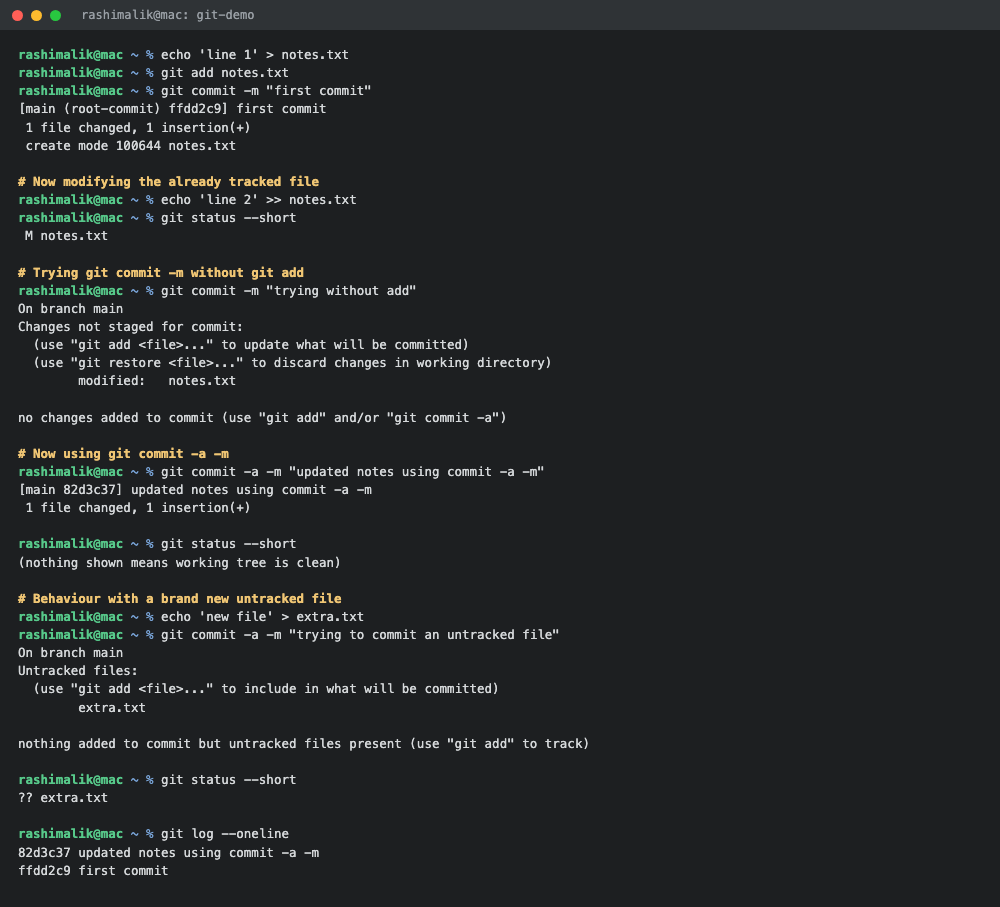
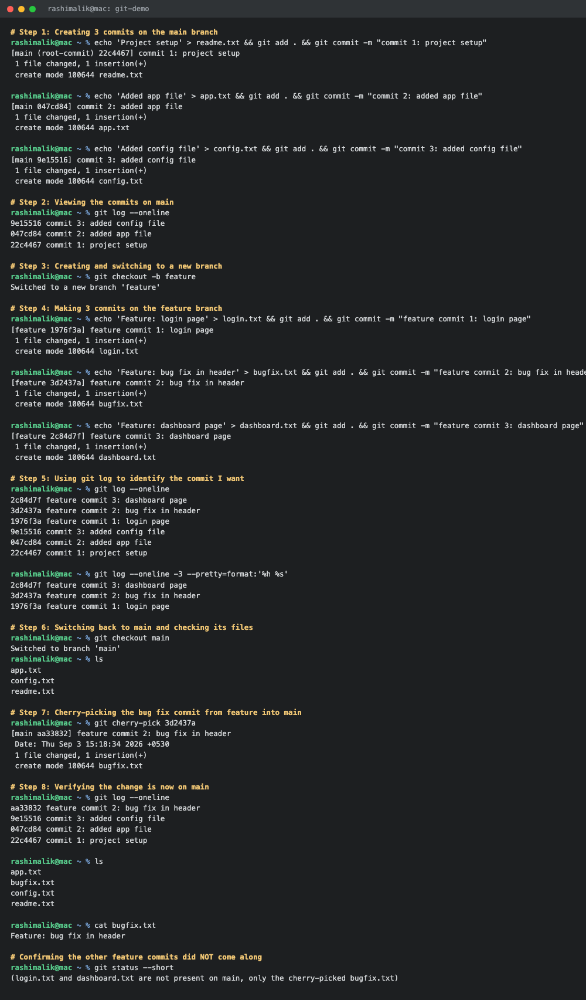

# Git / GitHub Homework

**Submitted by:** Rashi
**Roll No:** 10389
**Batch:** B

All commands were run on macOS.

---

## Task 1: `git commit -a -m` vs `git commit -m`

### The difference

| | `git commit -m "message"` | `git commit -a -m "message"` |
| :--- | :--- | :--- |
| Staging | Commits only what is already staged with `git add` | Automatically stages all modified and deleted tracked files, then commits |
| Untracked files | Not included | Still not included, `-a` does not pick up new files |
| Deleted files | Need `git add` or `git rm` first | Recorded automatically |
| Typical use | When you want to commit only some of your changes | When you have edited existing files and want to commit everything in one go |

The short version: `-a` is a shortcut for running `git add` on every file git is already tracking.
It saves a step, but it also removes the control you get from staging things selectively, and it
does nothing for files git has never seen before.

### Practice output

```console
$ echo 'line 1' > notes.txt
$ git add notes.txt
$ git commit -m "first commit"
[main (root-commit) ffdd2c9] first commit
 1 file changed, 1 insertion(+)
 create mode 100644 notes.txt
```

Now the tracked file is modified:

```console
$ echo 'line 2' >> notes.txt
$ git status --short
 M notes.txt
```

Trying `git commit -m` without staging first, git refuses:

```console
$ git commit -m "trying without add"
On branch main
Changes not staged for commit:
  (use "git add <file>..." to update what will be committed)
  (use "git restore <file>..." to discard changes in working directory)
	modified:   notes.txt

no changes added to commit (use "git add" and/or "git commit -a")
```

The same change with `git commit -a -m` goes through without any `git add`:

```console
$ git commit -a -m "updated notes using commit -a -m"
[main 82d3c37] updated notes using commit -a -m
 1 file changed, 1 insertion(+)

$ git status --short
(nothing shown, working tree is clean)
```

Now testing `-a` with a brand new untracked file:

```console
$ echo 'new file' > extra.txt
$ git commit -a -m "trying to commit an untracked file"
On branch main
Untracked files:
  (use "git add <file>..." to include in what will be committed)
	extra.txt

nothing added to commit but untracked files present (use "git add" to track)

$ git status --short
?? extra.txt
```

```console
$ git log --oneline
82d3c37 updated notes using commit -a -m
ffdd2c9 first commit
```

### What I observed

- `git commit -m` only commits the staging area. If nothing is staged, git stops and tells me to
  run `git add` or `git commit -a`.
- `git commit -a -m` staged and committed the modified `notes.txt` in a single step.
- `git commit -a -m` completely ignored `extra.txt` because it was untracked. So `-a` works only
  on files that git is already tracking, and a new file always needs `git add` first.



---

## Task 2: Git Cherry-Pick

Cherry-pick copies one specific commit from one branch and applies it on top of another branch.
It is useful when a branch has several commits but only one of them, like a bug fix, is needed on
main right away, without merging the whole branch.

### Step 1: Three commits on the main branch

```console
$ echo 'Project setup' > readme.txt && git add . && git commit -m "commit 1: project setup"
[main (root-commit) 22c4467] commit 1: project setup
 1 file changed, 1 insertion(+)
 create mode 100644 readme.txt

$ echo 'Added app file' > app.txt && git add . && git commit -m "commit 2: added app file"
[main 047cd84] commit 2: added app file
 1 file changed, 1 insertion(+)
 create mode 100644 app.txt

$ echo 'Added config file' > config.txt && git add . && git commit -m "commit 3: added config file"
[main 9e15516] commit 3: added config file
 1 file changed, 1 insertion(+)
 create mode 100644 config.txt
```

### Step 2: Viewing the commits with git log

```console
$ git log --oneline
9e15516 commit 3: added config file
047cd84 commit 2: added app file
22c4467 commit 1: project setup
```

### Step 3: Creating a new branch

```console
$ git checkout -b feature
Switched to a new branch 'feature'
```

### Step 4: Three commits on the feature branch

```console
$ echo 'Feature: login page' > login.txt && git add . && git commit -m "feature commit 1: login page"
[feature 1976f3a] feature commit 1: login page
 1 file changed, 1 insertion(+)
 create mode 100644 login.txt

$ echo 'Feature: bug fix in header' > bugfix.txt && git add . && git commit -m "feature commit 2: bug fix in header"
[feature 3d2437a] feature commit 2: bug fix in header
 1 file changed, 1 insertion(+)
 create mode 100644 bugfix.txt

$ echo 'Feature: dashboard page' > dashboard.txt && git add . && git commit -m "feature commit 3: dashboard page"
[feature 2c84d7f] feature commit 3: dashboard page
 1 file changed, 1 insertion(+)
 create mode 100644 dashboard.txt
```

### Step 5: Identifying the commit to pick

```console
$ git log --oneline
2c84d7f feature commit 3: dashboard page
3d2437a feature commit 2: bug fix in header
1976f3a feature commit 1: login page
9e15516 commit 3: added config file
047cd84 commit 2: added app file
22c4467 commit 1: project setup
```

The commit I want on main is `3d2437a` (the bug fix). The other two feature commits should stay
on the feature branch.

### Step 6: Going back to main

```console
$ git checkout main
Switched to branch 'main'

$ ls
app.txt
config.txt
readme.txt
```

At this point main does not have `bugfix.txt`.

### Step 7: Cherry-picking the commit

```console
$ git cherry-pick 3d2437a
[main aa33832] feature commit 2: bug fix in header
 Date: Thu Sep 3 15:18:34 2026 +0530
 1 file changed, 1 insertion(+)
 create mode 100644 bugfix.txt
```

### Step 8: Verifying the change is on main

```console
$ git log --oneline
aa33832 feature commit 2: bug fix in header
9e15516 commit 3: added config file
047cd84 commit 2: added app file
22c4467 commit 1: project setup

$ ls
app.txt
bugfix.txt
config.txt
readme.txt

$ cat bugfix.txt
Feature: bug fix in header
```

`login.txt` and `dashboard.txt` are still not on main, which confirms that only the one selected
commit was brought over.



### What I understood

- The cherry-picked commit got a **new hash** on main (`aa33832` instead of `3d2437a`). Git does
  not move the original commit, it creates a fresh commit with the same changes on top of the
  current branch.
- The commit message, author and original date are carried over, which is why the output shows a
  `Date:` line.
- If the same lines have been changed on both branches, cherry-pick can hit a conflict. In that
  case the fix is to resolve the files, `git add` them and then run `git cherry-pick --continue`,
  or `git cherry-pick --abort` to back out.
- Cherry-pick is handy for hotfixes, but using it too often creates duplicate commits across
  branches, so a normal merge is still the better option when the whole branch is ready.

---

## Useful Commands from This Session

| Command | Purpose |
| :--- | :--- |
| `git status --short` | Compact view of staged, modified and untracked files |
| `git add <file>` | Stage a file for the next commit |
| `git commit -m "msg"` | Commit whatever is currently staged |
| `git commit -a -m "msg"` | Stage all tracked modifications and commit in one step |
| `git log --oneline` | Short one line per commit history with hashes |
| `git checkout -b <branch>` | Create a new branch and switch to it |
| `git checkout <branch>` | Switch to an existing branch |
| `git cherry-pick <hash>` | Apply a single commit from another branch onto the current one |
| `git cherry-pick --abort` | Cancel a cherry-pick that ran into a conflict |
| `git cherry-pick --continue` | Finish a cherry-pick after resolving conflicts |

---

## Reference Links

See [resources.md](resources.md) for the git cheat sheets shared in the session.
