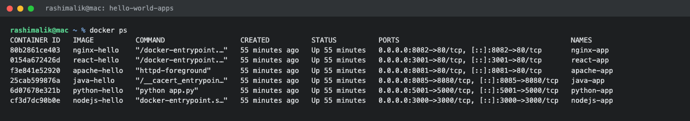

# Docker Homework: Hello World Applications

**Submitted by:** Rashi
**Roll No:** 10389
**Batch:** B

All commands were run on macOS with Docker Desktop.

---

## Applications

All six applications are inside [hello-world-apps/](hello-world-apps/).

```
session6-7-docker/
└── hello-world-apps/
    ├── nodejs-app/
    ├── python-app/
    ├── java-app/
    ├── Apache-app/
    ├── React-app/
    └── nginx-app/
```

---

## Applications and Ports

| Application | Base Image | Container Port | Host Port | URL |
| :--- | :--- | :--- | :--- | :--- |
| nodejs-app | `node:24-alpine` | 3000 | 3000 | http://localhost:3000 |
| python-app | `python:3.11-slim` | 5000 | 5001 | http://localhost:5001 |
| java-app | `eclipse-temurin:21-jdk` / `21-jre` | 8080 | 8085 | http://localhost:8085 |
| Apache-app | `httpd:2.4` | 80 | 8081 | http://localhost:8081 |
| React-app | `node:24-alpine` / `nginx:alpine` | 80 | 3001 | http://localhost:3001 |
| nginx-app | `nginx:alpine` | 80 | 8082 | http://localhost:8082 |

Port 5000 was already taken on my machine, so the Python container is mapped to host port 5001
instead. Java is on 8085 because port 8080 is being used by the multi-stage build task.

---

## 1. Node.js Application

**Files:** [nodejs-app/](hello-world-apps/nodejs-app/)

`server.js` runs a small Express server that returns an HTML heading.

```dockerfile
FROM node:24-alpine

WORKDIR /app

COPY package*.json ./

RUN npm install

COPY server.js ./

EXPOSE 3000

CMD ["npm", "start"]
```

```console
$ docker build -t nodejs-hello .
$ docker run -d --name nodejs-app -p 3000:3000 nodejs-hello
e6d7b12be231279dbeabbfb65a5c4613d3074615cb0a2fe37b492092e6f7f4ff

$ curl http://localhost:3000
<h1>Hello World from Node.js and Docker</h1>
```

`package*.json` is copied before the rest of the code on purpose. Docker caches each layer, so as
long as the dependencies do not change, the `npm install` layer is reused and only the code layer
is rebuilt.


---

## 2. Python Application

**Files:** [python-app/](hello-world-apps/python-app/)

A Flask app serving the same heading.

```dockerfile
FROM python:3.11-slim

WORKDIR /app

COPY requirements.txt .

RUN pip install --no-cache-dir -r requirements.txt

COPY app.py .

EXPOSE 5000

CMD ["python", "app.py"]
```

```console
$ docker build -t python-hello .
$ docker run -d --name python-app -p 5001:5000 python-hello
5e77a560fbac10b9e06d32c1e0ea5b53607fcdd429703eb9f2033e53238952e8

$ curl http://localhost:5001
<h1>Hello World from Python and Docker</h1>
```

Flask has to bind to `0.0.0.0` and not `127.0.0.1`. If it binds to localhost it only listens
inside the container and the port mapping will not reach it from outside.


---

## 3. Java Application

**Files:** [java-app/](hello-world-apps/java-app/)

A single Java file using the built in `HttpServer` class, so no Maven or Gradle is needed. The
Dockerfile compiles with a JDK image and then runs the compiled class on a smaller JRE image.

```dockerfile
# Stage 1: compile the java source
FROM eclipse-temurin:21-jdk AS builder

WORKDIR /app

COPY HelloWorld.java .

RUN javac HelloWorld.java

# Stage 2: run the compiled class on a smaller JRE image
FROM eclipse-temurin:21-jre

WORKDIR /app

COPY --from=builder /app/HelloWorld.class .

EXPOSE 8080

CMD ["java", "HelloWorld"]
```

```console
$ docker build -t java-hello .
$ docker run -d --name java-app -p 8085:8080 java-hello
3a94e4b47852ef331595fbb05ad5438e8a2cb7c2308b8e01711581c424e202e3

$ curl http://localhost:8085
<h1>Hello World from Java and Docker</h1>
```


---

## 4. Apache Application

**Files:** [Apache-app/](hello-world-apps/Apache-app/)

The official `httpd` image already serves files from `/usr/local/apache2/htdocs`, so the whole
Dockerfile is just copying the HTML page into that folder.

```dockerfile
FROM httpd:2.4

COPY index.html /usr/local/apache2/htdocs/index.html

EXPOSE 80
```

```console
$ docker build -t apache-hello .
$ docker run -d --name apache-app -p 8081:80 apache-hello
4651b548cc6bd78c07915c6a8a77dba5f8e62f5fd1851104ae467d8a7600aa70

$ curl http://localhost:8081
<h1>Hello World from Apache and Docker</h1>
```

There is no `CMD` here because the base image already has one, `httpd-foreground`, which keeps
Apache in the foreground so the container does not exit.


---

## 5. React Application

**Files:** [React-app/](hello-world-apps/React-app/)

A Vite React app built with a multi-stage Dockerfile. The first stage installs node modules and
produces the production build, and the second stage copies only the built `dist` folder into an
nginx image.

```dockerfile
# Stage 1: build the react app
FROM node:24-alpine AS builder

WORKDIR /app

COPY package*.json ./

RUN npm install

COPY . .

RUN npm run build

# Stage 2: serve the built static files with nginx
FROM nginx:alpine

COPY --from=builder /app/dist /usr/share/nginx/html

EXPOSE 80

CMD ["nginx", "-g", "daemon off;"]
```

```console
$ docker build -t react-hello .
...
#12 0.586 dist/index.html                  0.32 kB  gzip:  0.24 kB
#12 0.586 dist/assets/index-CkMH7Sba.js  194.71 kB  gzip: 60.91 kB
#12 0.586 built in 355ms

$ docker run -d --name react-app -p 3001:80 react-hello
8fcbb48b0a1486003cafaf31ab45d48520d0ec8309aab96961c9d8b5e29849cf

$ curl -o /dev/null -w "%{http_code}\n" http://localhost:3001
200
```

The heading does not show in `curl` output because React renders it in the browser with
JavaScript, so `curl` only sees the empty `<div id="root">`. Opening http://localhost:3001 in the
browser shows "Hello World from React and Docker".

The final image is 102MB because node and the build tools stay behind in the first stage. Without
multi-stage the whole `node_modules` folder would ship in the image.


---

## 6. Nginx Application

**Files:** [nginx-app/](hello-world-apps/nginx-app/)

```dockerfile
FROM nginx:alpine

COPY index.html /usr/share/nginx/html/index.html

EXPOSE 80

CMD ["nginx", "-g", "daemon off;"]
```

```console
$ docker build -t nginx-hello .
$ docker run -d --name nginx-app -p 8082:80 nginx-hello
71bff16f8124135ceb5ac2b51ba5de14aca1822ddd981b452229c7eea7ce1d17

$ curl http://localhost:8082
<h1>Hello World from Nginx and Docker</h1>
```

`daemon off;` is important. Nginx normally goes into the background, and a container stops the
moment its main process exits, so nginx has to be kept in the foreground.


---

## All Six Containers Running

```console
$ docker ps
CONTAINER ID   IMAGE          COMMAND                  CREATED          STATUS          PORTS                                         NAMES
80b2861ce403   nginx-hello    "/docker-entrypoint.…"   55 minutes ago   Up 55 minutes   0.0.0.0:8082->80/tcp, [::]:8082->80/tcp       nginx-app
0154a672426d   react-hello    "/docker-entrypoint.…"   55 minutes ago   Up 55 minutes   0.0.0.0:3001->80/tcp, [::]:3001->80/tcp       react-app
f3e841e52920   apache-hello   "httpd-foreground"       55 minutes ago   Up 55 minutes   0.0.0.0:8081->80/tcp, [::]:8081->80/tcp       apache-app
25cab599876a   java-hello     "/__cacert_entrypoin…"   55 minutes ago   Up 55 minutes   0.0.0.0:8085->8080/tcp, [::]:8085->8080/tcp   java-app
6d07678e321b   python-hello   "python app.py"          55 minutes ago   Up 55 minutes   0.0.0.0:5001->5000/tcp, [::]:5001->5000/tcp   python-app
cf3d7dc90b0e   nodejs-hello   "docker-entrypoint.s…"   55 minutes ago   Up 55 minutes   0.0.0.0:3000->3000/tcp, [::]:3000->3000/tcp   nodejs-app
```

```console
$ docker images
IMAGE                  ID             DISK USAGE   CONTENT SIZE
apache-hello:latest    6c5ffcd28d7d        205MB         45.5MB
java-hello:latest      eca2f35fe833        474MB          113MB
nginx-hello:latest     242f0c80669c        102MB           29MB
nodejs-hello:latest    470311088b42        249MB         61.8MB
python-hello:latest    d8d50257b5c0        248MB         54.9MB
react-hello:latest     f5b74e0da11a        102MB         29.1MB
```



---

## Build and Run Commands for All Applications

```bash
cd hello-world-apps

docker build -t nodejs-hello ./nodejs-app
docker build -t python-hello ./python-app
docker build -t java-hello   ./java-app
docker build -t apache-hello ./Apache-app
docker build -t react-hello  ./React-app
docker build -t nginx-hello  ./nginx-app

docker run -d --name nodejs-app -p 3000:3000 nodejs-hello
docker run -d --name python-app -p 5001:5000 python-hello
docker run -d --name java-app   -p 8085:8080 java-hello
docker run -d --name apache-app -p 8081:80   apache-hello
docker run -d --name react-app  -p 3001:80   react-hello
docker run -d --name nginx-app  -p 8082:80   nginx-hello
```

Cleaning up afterwards:

```bash
docker rm -f nodejs-app python-app java-app apache-app react-app nginx-app
```

---

## What I Understood

- `EXPOSE` only documents which port the application listens on inside the container. It does not
  publish anything by itself, the actual mapping happens with `-p host:container` at run time.
- The order of instructions in a Dockerfile decides how well the build cache works. Dependency
  files should be copied and installed before the application code, since code changes far more
  often than dependencies.
- Every Dockerfile instruction creates a layer, and layers are shared between images. That is why
  `react-hello` and `nginx-hello` both use `nginx:alpine` and the second build was almost instant.
- The container's main process must stay in the foreground. Nginx needs `daemon off;` and Apache
  uses `httpd-foreground` for exactly this reason.
- Alpine and slim base images give much smaller final images than the full ones, which matters
  when images are being pushed and pulled repeatedly.
- The multi-stage pattern used in the React and Java apps keeps compilers and build tools out of
  the final image, so what ships is only what is needed to run.

---

## Other Docker Notes

Docker commands and cleanup notes from the session are in [docker.md](docker.md), and the
multi-stage build homework is written up in
[multi-stage-dockerfile/README.md](multi-stage-dockerfile/README.md).
