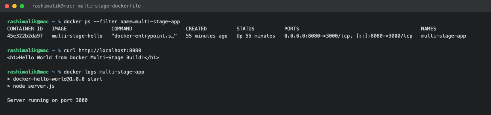

# Docker Multi-Stage Build Homework

**Submitted by:** Rashi
**Enrollment / Roll No:** 10389
**Batch:** B

All commands were run on macOS with Docker Desktop.

---

## Task 1: Run the Multi-Stage Dockerfile

The multi-stage Dockerfile and its application code are in
[multi-stage-dockerfile/](multi-stage-dockerfile/).

### The Dockerfile

```dockerfile
# -------------------------
# Stage 1: Build
# -------------------------
FROM node:24-alpine AS builder
WORKDIR /app
COPY package*.json ./
RUN npm install
COPY . .

# -------------------------
# Stage 2: Production
# -------------------------
FROM node:24-alpine AS production
WORKDIR /app
COPY --from=builder /app/package*.json ./
RUN npm install --omit=dev
COPY --from=builder /app/server.js ./
EXPOSE 3000
CMD ["npm", "start"]
```

### Building the Image

```console
$ cd multi-stage-dockerfile
$ docker build -t multi-stage-hello .
...
naming to docker.io/library/multi-stage-hello:latest done
```

### Running the Container on Port 8080

The application listens on port 3000 inside the container, so it is published on host port 8080.

```console
$ docker run -d --name multi-stage-app -p 8080:3000 multi-stage-hello
a6f6b2ef1bd1292922fc78bfedfef0d9fe071616fa84f4dfa72d4a29f94ced76
```

### Accessing the Application

```console
$ curl http://localhost:8080
<h1>Hello World from Docker Multi-Stage Build!</h1>
```

The same page opened in the browser at http://localhost:8080 shows:

```
Hello World from Docker multi-stage build
```


### Container Logs

```console
$ docker logs multi-stage-app

> docker-hello-world@1.0.0 start
> node server.js

Server running on port 3000
```

---

## Task 2: Verifying with `docker ps`

```console
$ docker ps
CONTAINER ID   IMAGE               COMMAND                  CREATED          STATUS          PORTS                                         NAMES
45e322b2da97   multi-stage-hello   "docker-entrypoint.s…"   55 minutes ago   Up 55 minutes   0.0.0.0:8080->3000/tcp, [::]:8080->3000/tcp   multi-stage-app
```

The `PORTS` column confirms `0.0.0.0:8080->3000/tcp`, so host port 8080 is forwarding to the
application's port 3000 inside the container, and the status is `Up`.



---

## Why Multi-Stage Builds Are Used

Comparing the multi-stage image against the plain single-stage Node image built for the same kind
of app:

```console
$ docker images
IMAGE                      ID             DISK USAGE   CONTENT SIZE
multi-stage-hello:latest   17aa0281143d        243MB         60.9MB
nodejs-hello:latest        470311088b42        249MB         61.8MB
```

For a small Express app with only one dependency the saving is small. The difference becomes
large in a real project, because:

- The build stage can install every dev dependency, compiler and build tool it needs, and none of
  that ends up in the final image. Only what is copied with `COPY --from=builder` is kept.
- The production stage here runs `npm install --omit=dev`, so test libraries, linters and build
  tools are left out.
- A smaller image means faster pushes and pulls, less storage in the registry, and a smaller
  attack surface since fewer packages are installed in the running container.
- The React app in [hello-world-apps/React-app](hello-world-apps/React-app/) shows the bigger
  win. Node and the whole `node_modules` folder stay in the build stage, and the final image is
  just nginx with the built static files, at 102MB.

---

## Task 3: Docker Application Deployment

The requirement was to deploy at least three different types of applications with Docker. Six
were built and run, all documented with output in [README.md](README.md).

| Application | Image | Host Port | Result |
| :--- | :--- | :--- | :--- |
| Node.js | `nodejs-hello` | 3000 | Hello World from Node.js and Docker |
| Python (Flask) | `python-hello` | 5001 | Hello World from Python and Docker |
| Java | `java-hello` | 8085 | Hello World from Java and Docker |
| Apache | `apache-hello` | 8081 | Hello World from Apache and Docker |
| React | `react-hello` | 3001 | Hello World from React and Docker |
| Nginx | `nginx-hello` | 8082 | Hello World from Nginx and Docker |

```console
$ docker ps
CONTAINER ID   IMAGE          COMMAND                  CREATED          STATUS          PORTS                                         NAMES
80b2861ce403   nginx-hello    "/docker-entrypoint.…"   55 minutes ago   Up 55 minutes   0.0.0.0:8082->80/tcp, [::]:8082->80/tcp       nginx-app
0154a672426d   react-hello    "/docker-entrypoint.…"   55 minutes ago   Up 55 minutes   0.0.0.0:3001->80/tcp, [::]:3001->80/tcp       react-app
f3e841e52920   apache-hello   "httpd-foreground"       55 minutes ago   Up 55 minutes   0.0.0.0:8081->80/tcp, [::]:8081->80/tcp       apache-app
25cab599876a   java-hello     "/__cacert_entrypoin…"   55 minutes ago   Up 55 minutes   0.0.0.0:8085->8080/tcp, [::]:8085->8080/tcp   java-app
6d07678e321b   python-hello   "python app.py"          55 minutes ago   Up 55 minutes   0.0.0.0:5001->5000/tcp, [::]:5001->5000/tcp   python-app
cf3d7dc90b0e   nodejs-hello   "docker-entrypoint.s…"   55 minutes ago   Up 55 minutes   0.0.0.0:3000->3000/tcp, [::]:3000->3000/tcp   nodejs-app
```


---

## What I Understood

- `AS builder` gives a stage a name, and `COPY --from=builder` pulls specific files out of it.
  Everything else from that stage is thrown away.
- A Dockerfile can have as many stages as needed, and the last stage is what becomes the image
  unless `--target` is used to stop at an earlier one.
- Only the layers of the final stage are kept in the image, which is what keeps the size down.
- Multi-stage is the normal pattern for compiled and bundled languages: Java compiled with a JDK
  but run on a JRE, React built with node but served by nginx, Go built with the toolchain but
  shipped as a bare binary.
