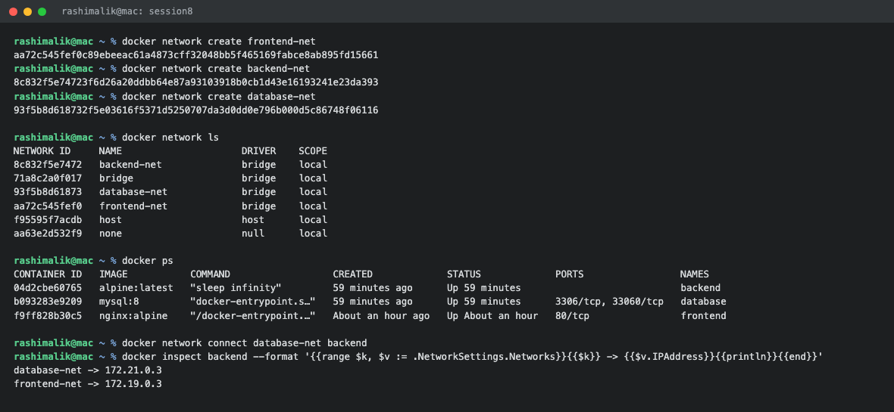
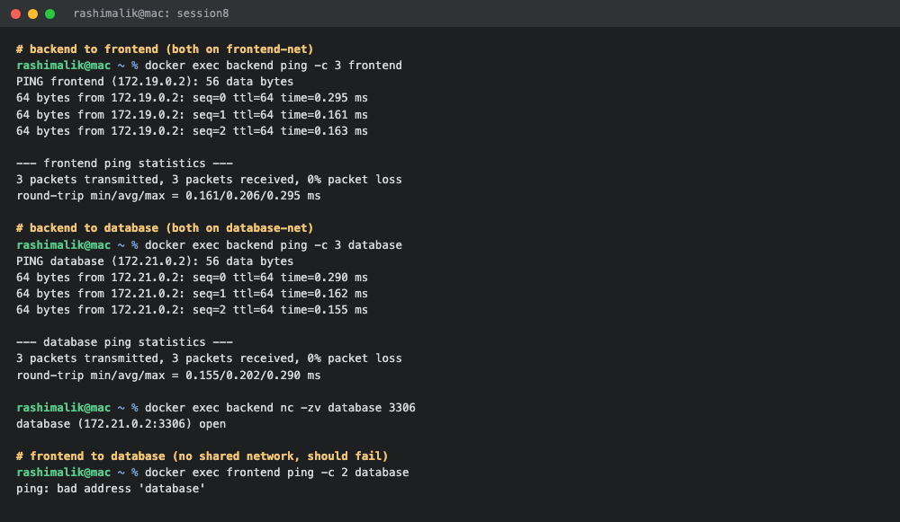

# Docker Networking and Volume Homework

**Submitted by:** Rashi
**Roll No:** 10389
**Batch:** B

All commands were run on macOS with Docker Desktop.

---

## Task 1: Docker Container Networking

Three containers, three networks, and the backend container attached to two of them.

### Creating the three networks

```console
$ docker network create frontend-net
aa72c545fef0c89ebeeac61a4873cff32048bb5f465169fabce8ab895fd15661

$ docker network create backend-net
8c832f5e74723f6d26a20ddbb64e87a93103918b0cb1d43e16193241e23da393

$ docker network create database-net
93f5b8d618732f5e03616f5371d5250707da3d0dd0e796b000d5c86748f06116

$ docker network ls
NETWORK ID     NAME           DRIVER    SCOPE
8c832f5e7472   backend-net    bridge    local
71a8c2a0f017   bridge         bridge    local
93f5b8d61873   database-net   bridge    local
aa72c545fef0   frontend-net   bridge    local
f95595f7acdb   host           host      local
aa63e2d532f9   none           null      local
```

A network created without `--driver` uses the `bridge` driver by default.

### Creating the three containers

```console
$ docker run -d --name frontend --network frontend-net nginx:alpine
f9ff828b30c5f37ed5735db933d495edb1cdd4d622814cae68c2699750496cd4

$ docker run -d --name database --network database-net -e MYSQL_ROOT_PASSWORD=root123 -e MYSQL_DATABASE=devopsdb mysql:8
b093283e9209147be3c5128a55ee0adebaa1b1cf3debfe21f00d7e1665dec2c3

$ docker run -d --name backend --network frontend-net alpine:latest sleep infinity
04d2cbe60765f52ff460f1c116b7d5a79119ba40f058425e65b539b4dd496b8f
```

The alpine container needs `sleep infinity` as its command. Without a long running process the
container would start and immediately exit, because a container lives only as long as its main
process.

### Adding the backend container to a second network

```console
$ docker network connect database-net backend
```

The command prints nothing when it succeeds. Checking which networks the backend is on now:

```console
$ docker inspect backend --format '{{range $k, $v := .NetworkSettings.Networks}}{{$k}} -> {{$v.IPAddress}}{{println}}{{end}}'
database-net -> 172.21.0.3
frontend-net -> 172.19.0.3
```

The backend has one IP on each network, which is what lets it talk to both sides.

```console
$ docker ps
CONTAINER ID   IMAGE           COMMAND                  CREATED             STATUS             PORTS                 NAMES
04d2cbe60765   alpine:latest   "sleep infinity"         59 minutes ago      Up 59 minutes                            backend
b093283e9209   mysql:8         "docker-entrypoint.s…"   59 minutes ago      Up 59 minutes      3306/tcp, 33060/tcp   database
f9ff828b30c5   nginx:alpine    "/docker-entrypoint.…"   About an hour ago   Up About an hour   80/tcp                frontend
```



### Checking connectivity

**Backend to frontend** (both are on `frontend-net`):

```console
$ docker exec backend ping -c 3 frontend
PING frontend (172.19.0.2): 56 data bytes
64 bytes from 172.19.0.2: seq=0 ttl=64 time=0.295 ms
64 bytes from 172.19.0.2: seq=1 ttl=64 time=0.161 ms
64 bytes from 172.19.0.2: seq=2 ttl=64 time=0.163 ms

--- frontend ping statistics ---
3 packets transmitted, 3 packets received, 0% packet loss
round-trip min/avg/max = 0.161/0.206/0.295 ms

$ docker exec backend wget -qO- http://frontend | head -5
<!DOCTYPE html>
<html>
<head>
<title>Welcome to nginx!</title>
<style>
```

**Backend to database** (both are on `database-net`):

```console
$ docker exec backend ping -c 3 database
PING database (172.21.0.2): 56 data bytes
64 bytes from 172.21.0.2: seq=0 ttl=64 time=0.290 ms
64 bytes from 172.21.0.2: seq=1 ttl=64 time=0.162 ms
64 bytes from 172.21.0.2: seq=2 ttl=64 time=0.155 ms

--- database ping statistics ---
3 packets transmitted, 3 packets received, 0% packet loss
round-trip min/avg/max = 0.155/0.202/0.290 ms

$ docker exec backend nc -zv database 3306
database (172.21.0.2:3306) open
```

**Frontend to database** (no shared network, this should fail):

```console
$ docker exec frontend ping -c 2 database
ping: bad address 'database'
```

**Frontend to backend** (both on `frontend-net`):

```console
$ docker exec frontend ping -c 2 backend
PING backend (172.19.0.3): 56 data bytes
64 bytes from 172.19.0.3: seq=0 ttl=64 time=0.028 ms
64 bytes from 172.19.0.3: seq=1 ttl=64 time=0.159 ms

--- backend ping statistics ---
2 packets transmitted, 2 packets received, 0% packet loss
```



### What I understood from this

- Docker's built in DNS resolves container names automatically on user defined networks, which is
  why `ping frontend` works without knowing any IP address.
- That DNS only works within a shared network. `frontend` could not even resolve the name
  `database`, and the error was `bad address` and not a timeout, meaning the name lookup itself
  failed rather than the packet being lost.
- Each network gets its own subnet: `frontend-net` is `172.19.0.0/16` and `database-net` is
  `172.21.0.0/16`.
- The backend sitting on two networks is exactly the pattern used in real deployments. The
  frontend can reach the backend, the backend can reach the database, but the frontend has no path
  to the database at all. The isolation is enforced by the network layout instead of by firewall
  rules.
- Container name resolution does not work on the old default `bridge` network, only on user
  defined networks, which is one more reason to always create a named network.

---

## Task 2: Host Network

```console
$ docker pull httpd:2.4
Status: Downloaded newer image for httpd:2.4
docker.io/library/httpd:2.4

$ docker run -d --name apache-host --network host httpd:2.4
7aaa1c38b190f291c5ced8be7e1f6cc8952a420a6515fa7ab9ec55b13cbbd26b

$ docker ps --filter name=apache-host
CONTAINER ID   IMAGE       COMMAND              CREATED        STATUS         PORTS     NAMES
7aaa1c38b190   httpd:2.4   "httpd-foreground"   1 second ago   Up 1 second              apache-host
```

The `PORTS` column is empty, which is expected. With `--network host` there is no port mapping
because the container is not in a separate network namespace at all, it uses the host's network
stack directly. Apache binds straight to port 80 of the host.

Accessing the site on port 80:

```console
$ docker run --rm --network host alpine wget -qO- http://localhost:80
<!DOCTYPE HTML PUBLIC "-//W3C//DTD HTML 4.01//EN" "http://www.w3.org/TR/html4/strict.dtd">
<html>
<head>
<title>It works! Apache httpd</title>
</head>
<body>
<p>It works!</p>
</body>
```

```console
$ docker logs apache-host
[Thu Sep 03 09:56:59 2026] [mpm_event:notice] [pid 1:tid 1] AH00489: Apache/2.4.68 (Unix) configured -- resuming normal operations
[Thu Sep 03 09:56:59 2026] [core:notice] [pid 1:tid 1] AH00094: Command line: 'httpd -D FOREGROUND'
::1 - - [03/Sep/2026:09:57:09 +0000] "GET / HTTP/1.1" 200 191
```

### One important thing I found out

I am running Docker Desktop on macOS. Docker needs a Linux kernel, so on macOS it runs inside a
small Linux virtual machine. That means `--network host` gives the container the network stack of
that **virtual machine**, not of my Mac. So `http://localhost:80` in my Mac browser does not
reach it, which is why the check above was done from another container on the same host network.

On a real Linux machine there is no VM in between, the container really does share the host's
network stack, and `curl http://localhost:80` from the host terminal works straight away.

To view the same Apache page in my browser on macOS, the normal bridge network with a published
port is used instead:

```console
$ docker run -d --name apache-host -p 80:80 httpd:2.4
e82a4b1108bda5e4ebee648165dd5c44570edd83f5d44ac0fb1472a99248b38a

$ curl http://localhost:80
<!DOCTYPE HTML PUBLIC "-//W3C//DTD HTML 4.01//EN" "http://www.w3.org/TR/html4/strict.dtd">
<html>
<head>
<title>It works! Apache httpd</title>
</head>
<body>
<p>It works!</p>
</body>

$ docker ps --filter name=apache-host
CONTAINER ID   IMAGE       COMMAND              CREATED         STATUS         PORTS                                 NAMES
e82a4b1108bd   httpd:2.4   "httpd-foreground"   2 seconds ago   Up 2 seconds   0.0.0.0:80->80/tcp, [::]:80->80/tcp   apache-host
```


### Bridge vs Host network

| | Bridge (default) | Host |
| :--- | :--- | :--- |
| Network namespace | Container gets its own | Shares the host's |
| Port publishing | Needed, `-p 80:80` | Not used, the container binds host ports directly |
| Container to container by name | Works on user defined networks | No isolation, everything is on the host network |
| Port conflicts | Different containers can all use port 80 internally | Two containers cannot both bind port 80 |
| Performance | Small overhead from NAT | Slightly faster, no NAT layer |
| Platform | Works everywhere | Only truly host level on Linux |

Host networking is worth using when NAT overhead actually matters or when a service needs a large
range of ports, but it gives up the isolation that is the main reason to use containers, so bridge
is the normal choice.

---

## Task 3: Bind Mount

### Creating the folder and file on my machine

```console
$ mkdir bind-mount-demo
$ cd bind-mount-demo
$ cat index.html
<!DOCTYPE html>
<html>
<head>
    <title>Bind Mount Demo</title>
</head>
<body>
    <h1>Hello students</h1>
</body>
</html>
```

The folder is committed here: [bind-mount-demo/](bind-mount-demo/)

### Bind mounting the folder into an nginx container

```console
$ docker run -d --name nginx-bind -p 8090:80 -v $(pwd):/usr/share/nginx/html nginx:alpine
788b5a7d8369b432add12d88487d0bdd9be87dde9f1302b34bc0ac8a6642c8b5
```

Port 8090 was used because port 80 was already taken by the Apache container from Task 2.

```console
$ docker inspect nginx-bind --format '{{range .Mounts}}{{.Type}}  {{.Source}} -> {{.Destination}}{{end}}'
bind  /Users/rashimalik/Desktop/DEVOPS/devops-heros/session8-docker-networking-volume/bind-mount-demo -> /usr/share/nginx/html
```

### Accessing the site

```console
$ curl http://localhost:8090
<!DOCTYPE html>
<html>
<head>
    <title>Bind Mount Demo</title>
</head>
<body>
    <h1>Hello students</h1>
</body>
</html>
```


### Modifying the file without restarting the container

```console
$ sed -i 's/Hello students/Hello students, this file was edited on the host without restarting the container/' index.html

$ cat index.html
<!DOCTYPE html>
<html>
<head>
    <title>Bind Mount Demo</title>
</head>
<body>
    <h1>Hello students, this file was edited on the host without restarting the container</h1>
</body>
</html>
```

The container was left running the whole time, no restart and no rebuild:

```console
$ curl http://localhost:8090
<!DOCTYPE html>
<html>
<head>
    <title>Bind Mount Demo</title>
</head>
<body>
    <h1>Hello students, this file was edited on the host without restarting the container</h1>
</body>
</html>

$ docker exec nginx-bind cat /usr/share/nginx/html/index.html
<!DOCTYPE html>
<html>
<head>
    <title>Bind Mount Demo</title>
</head>
<body>
    <h1>Hello students, this file was edited on the host without restarting the container</h1>
</body>
</html>

$ docker ps --filter name=nginx-bind
CONTAINER ID   IMAGE          COMMAND                  CREATED         STATUS         PORTS                                     NAMES
788b5a7d8369   nginx:alpine   "/docker-entrypoint.…"   2 seconds ago   Up 2 seconds   0.0.0.0:8090->80/tcp, [::]:8090->80/tcp   nginx-bind
```

The change showed up immediately. The file in this repository has been put back to
`Hello students` after the test.


### What I understood

- A bind mount is not a copy. The host folder is mounted into the container, so both sides are
  looking at exactly the same files on disk. Any edit on either side is visible instantly.
- `COPY` in a Dockerfile bakes files into the image at build time, so changing them means
  rebuilding. A bind mount keeps files outside the image, which is why it is the standard way to
  develop locally with hot reload.
- The bind mount replaces whatever was already at that path inside the container. Nginx's default
  welcome page at `/usr/share/nginx/html` was hidden the moment the folder was mounted over it.
- Bind mounts depend on an absolute path existing on the host machine, so they are not portable
  and are not the right choice for production. Named volumes are, because Docker manages the
  storage itself.

### Bind mount vs named volume

| | Bind Mount | Named Volume |
| :--- | :--- | :--- |
| Where the data lives | A folder chosen by me on the host | Managed by Docker under `/var/lib/docker/volumes` |
| Syntax | `-v /host/path:/container/path` | `-v volume-name:/container/path` |
| Created automatically | No, the host path must exist | Yes, Docker creates it if missing |
| Editing from the host | Direct, any editor works | Needs `docker cp` or a container |
| Main use | Local development, config files, live editing | Databases and any data that must survive the container |

---

## Task 4: Overlay Network

### What it is

An overlay network is a Docker network that stretches across **several Docker hosts**. Bridge
networks only exist inside one machine, so two containers on two different servers cannot reach
each other by name on a bridge. An overlay network puts containers running on different physical
or virtual machines onto one single virtual network, where they can talk to each other by
container or service name as if they were all on the same box.

### How it works

- It uses **VXLAN** encapsulation. The original container packet is wrapped inside a UDP packet,
  sent across the real physical network to the other host, unwrapped there, and delivered to the
  target container. The containers themselves never see any of this and just think they are on
  one flat network.
- Docker keeps a **key value store** of which container has which IP on which host. In Swarm mode
  the manager nodes handle this themselves, and it is what makes service discovery across hosts
  possible.
- Each host gets its own IP range out of the overlay's subnet, so addresses never clash.
- The ports that must be open between hosts are `2377/tcp` for cluster management, `7946/tcp` and
  `7946/udp` for node to node communication, and `4789/udp` for the VXLAN traffic itself.
- Traffic can be encrypted with `--opt encrypted`, which turns on IPsec between the nodes. It is
  off by default because it costs performance.

### Creating one

```bash
# on the manager node
docker swarm init

# create an attachable overlay network
docker network create --driver overlay --attachable my-overlay

# services placed on this network can reach each other across all nodes
docker service create --name web --network my-overlay --replicas 3 nginx:alpine
```

`--attachable` is needed if plain `docker run` containers should also be able to join the network.
Without it only Swarm services can use it.

### Where it is used

- Docker Swarm clusters, where one service is replicated over several nodes and the replicas need
  to talk to each other.
- Microservices spread across multiple servers that must find each other by name without anyone
  hardcoding IP addresses.
- Any setup that needs a container to be moved or rescheduled to a different host without
  breaking the connections to it.
- Kubernetes solves the same problem, but with its own CNI plugins such as Flannel or Calico
  instead of Docker's overlay driver. The idea of one flat virtual network over many machines is
  the same.

### Comparison of the network drivers

| Driver | Scope | What it is for |
| :--- | :--- | :--- |
| `bridge` | Single host | The default, container to container on one machine |
| `host` | Single host | Container uses the host's network stack directly, no isolation |
| `none` | Single host | No networking at all, full isolation |
| `overlay` | Multiple hosts | Containers across a Swarm cluster on one virtual network |
| `macvlan` | Single host | Gives the container its own MAC and an IP on the physical LAN |
| `ipvlan` | Single host | Like macvlan but shares the host's MAC address |

---

## Cleanup

```bash
docker rm -f frontend backend database apache-host nginx-bind
docker network rm frontend-net backend-net database-net
```

---

## Reference

Docker network drivers documentation: https://docs.docker.com/engine/network/drivers/
